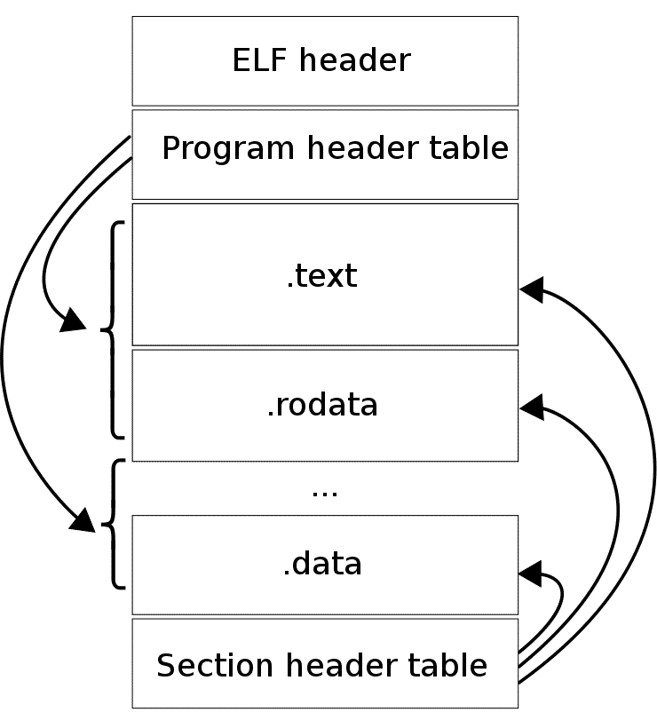

# Elf Files
 
Reference Sources :
    - The ELF file Specifications : (from [Linux Foundation](https://refspecs.linuxfoundation.org/elf/elf.pdf)) (From [CMU.edu](https://www.cs.cmu.edu/afs/cs/academic/class/15213-f00/docs/elf.pdf))
    - https://wiki.osdev.org/ELF
    - [Tools in inspecting Elf files](https://linuxhint.com/understanding_elf_file_format/)

### The ELF file format

There are many file format standards. Humanity needed to agree on how certain important bytes get arranged. In this case, humaniy agreed on how to arrange bytes of an executable binary or a library object file or a core dump. So it was called the ELF file format. There are other formats.... but those are none of our concern, we are purists.


    A relocatable object file holds sections containing code and data. This file is suitable to be linked with other relocatable object files to create dynamic executable files, shared object files, or another relocatable object.

    A dynamic executable file holds a program that is ready to execute. The file specifies how exec(2) creates a program's process image. This file is typically bound to shared object files at runtime to create a process image.

    A shared object file holds code and data that is suitable for additional linking. The link-editor can process this file with other relocatable object files and shared object files to create other object files. The runtime linker combines this file with a dynamic executable file and other shared object files to create a process image.


ELF’s *design* is not limited to a specific processor, instruction set, or hardware architecture.  

The reason we agreed on a standard is mainly for the sake of simplicity.  
You can write software that loads programs to the CPU without knowing which programs will finally run on that CPU. As long as those programs follow the ELF format.   
You can write software that links executables (a linker) or Debuggers (software that inspects executables) more easily... because you can count on the fact that executable programs will always follow a certain format.  

Developers no longer have to read many documentations about how bytes in a file are organized... they just have to read one file format... the elf file. Life is good.  

With the ELF format, programmers can just compile their source code for a specific architecture (eg Riscv) and expect that the program will have no problem running on any RISCV implementation.

The specification does not clarify the filename extension for ELF files. In use is a variety of letter combinations, such as .axf, .bin, .elf, .o, .prx, .puff, .ko, .so, and .mod, or none.  Some file systems don't give a hoot about the extension... a file is just a bunch of bytes... attaching meaning to a file is overengineering ... right?

##### So What is the format?

You can read the specifications of the format in the official specifications : The ELF file Specifications : (from [Linux Foundation](https://refspecs.linuxfoundation.org/elf/elf.pdf)) (From [CMU.edu](https://www.cs.cmu.edu/afs/cs/academic/class/15213-f00/docs/elf.pdf))

You can get a summary of the specification by running the following command on a linux machine terminal : 
```bash
man elf
```  
Yea that's right, linux is not an operating system... it is a development software.  


An executable file using the ELF file format consists of an ELF header,
followed by a program header table or a section header table, or  both.
The  ELF  header  is  always  at  offset zero of the file.  The program
header table and the section header table's  offset  in  the  file  are
defined  in  the  ELF  header.  The two tables describe the rest of the
particularities of the file

###### Tools used to handle the ELF file.  
Now, the elf file is in binary, it is full of zeros and ones... quite unreadable.  
So people from the past came up with tools to inspect the ELF file in a slightly readable way.  

***1. The Hexdump  ***
One way was to convert each byte in the binary file into their hexadecimal equivalent. A byte gets represented by 2 hex digits.  Printable Characters are then represented in their equivalent ascii values... but in hex.  
This tool is called a **Hexdump program**.  Linux comes with an inbuilt hexdump which you can access through the command line as follows :  
```bash
hexdump -C input_file.txt    // the file can be any extension
man hexdump                  // this command will help you get hexdumps documentation
```
The -C flag (capital C, not small c) means that the output should be in Canonical hex+ASCII display. This information does not matter now. just cram it.

***2. THe Readelf***  
But the Hexdump was not enough... who understands Hex... I know I don't.  
Ro readelf was made, with readelf you can get different sections in more human terms.  

```bash
readelf -h hello  // show Elf header
readelf -l hello  // show program header table and Segment-to-section mapping
```

##### Format
The Elf file has 2 main parts :
    - The ELF Header (description if the file data)
    - The file data (data being described by elf header) 

The File Data part contains :
    - The program header table : describes zero or more **segments**
    - The section header table : describe zero or more *sections*
    - Data                     : contains the actual data referred to by the program header table and section header table.

*What is the difference between **segments** and **sections**?*    
    A Section is an individual unit of either data or code. And it is given a unique name because it serves a unique purpose.  
    For example, we have may Code section, data section, bss section, symbol table section.  

    On the other hand segments are units that house sections. The segments describe the memory addresses that the runtime will use to load the sections within it into memory. So sections are found within segments.

    To summarize, sections are the individual units of code and data within an ELF file, while segments are groups of sections that are combined together for the purpose of being loaded into memory at runtime.

Here is a diagram presentation of the ELF File Format :  


###### The Elf Header
This part is 32 bytes long... ALWAYS.  
It starts at address 0. Its first 4 bytes (32 bits) contain the magic Number. The magic number is used to identify th file format. In our case the 4 bytes spell out 'ELF' ie 0x7F followed by 0x45, 0x4c, and 0x46.

Here is a sample elf header :  
```bash
readelf -h hello  // show Elf header
readelf -l hello  // show program header table and Segment-to-section mapping
ELF Header:
  Magic:   7f 45 4c 46 02 01 01 00 00 00 00 00 00 00 00 00 
  Class:                             ELF64
  Data:                              2's complement, little endian
  Version:                           1 (current)
  OS/ABI:                            UNIX - System V
  ABI Version:                       0
  Type:                              DYN (Shared object file)
  Machine:                           Advanced Micro Devices X86-64
  Version:                           0x1
  Entry point address:               0x87f0
  Start of program headers:          64 (bytes into file)
  Start of section headers:          4267608 (bytes into file)
  Flags:                             0x0
  Size of this header:               64 (bytes)
  Size of program headers:           56 (bytes)
  Number of program headers:         12
  Size of section headers:           64 (bytes)
  Number of section headers:         42
  Section header string table index: 41

```

Here is a more detailed Header Layout and Possible Values (extracted from : [OSDev Wiki](https://wiki.osdev.org/ELF))   


###### The Program Header Table
The Program Header Table, also known as the "segment header table," is a section of an ELF (Executable and Linkable Format) file that provides information about the program's memory layout at runtime.

The Program Header Table defines the layout of the program in memory, by specifying the segments that make up the program and the attributes of each segment. A segment is a part of the program's memory layout that has a specific type and purpose.

The Program Header Table contains entries for each segment in the program, and each entry specifies the following information:

    - Segment type: describes the type and purpose of the segment, such as code, data, stack, or dynamic linking information.
    - Segment offset: specifies the offset of the segment within the file.
    - Virtual address: specifies the virtual address of the segment in memory.
    - Physical address: specifies the physical address of the segment in memory (if applicable).
    - Segment size: specifies the size of the segment in bytes.
    - Flags: specifies various flags that control the behavior of the segment, such as read/write/execute permissions.

The information in the Program Header Table is used by the operating system to load the program into memory, by mapping the segments specified in the table to their corresponding memory locations. This allows the program to execute correctly, with the proper memory layout and permissions. 

```bash
readelf -l hello

Elf file type is DYN (Shared object file)
Entry point 0x87f0
There are 12 program headers, starting at offset 64

Program Headers:
  Type           Offset             VirtAddr           PhysAddr
                 FileSiz            MemSiz              Flags  Align
  PHDR           0x0000000000000040 0x0000000000000040 0x0000000000000040
                 0x00000000000002a0 0x00000000000002a0  R      0x8
  INTERP         0x00000000000002e0 0x00000000000002e0 0x00000000000002e0
                 0x000000000000001c 0x000000000000001c  R      0x1
      [Requesting program interpreter: /lib64/ld-linux-x86-64.so.2]
  LOAD           0x0000000000000000 0x0000000000000000 0x0000000000000000
                 0x00000000000052b0 0x00000000000052b0  R      0x1000
  LOAD           0x0000000000006000 0x0000000000006000 0x0000000000006000
                 0x00000000000382a1 0x00000000000382a1  R E    0x1000
  LOAD           0x000000000003f000 0x000000000003f000 0x000000000003f000
                 0x000000000000cdd0 0x000000000000cdd0  R      0x1000
  LOAD           0x000000000004c270 0x000000000004d270 0x000000000004d270
                 0x0000000000002dc0 0x0000000000002ed0  RW     0x1000
  DYNAMIC        0x000000000004e6f8 0x000000000004f6f8 0x000000000004f6f8
                 0x0000000000000230 0x0000000000000230  RW     0x8
  NOTE           0x00000000000002fc 0x00000000000002fc 0x00000000000002fc
                 0x0000000000000044 0x0000000000000044  R      0x4
  TLS            0x000000000004c270 0x000000000004d270 0x000000000004d270
                 0x0000000000000028 0x0000000000000050  R      0x8
  GNU_EH_FRAME   0x0000000000043d9c 0x0000000000043d9c 0x0000000000043d9c
                 0x00000000000010c4 0x00000000000010c4  R      0x4
  GNU_STACK      0x0000000000000000 0x0000000000000000 0x0000000000000000
                 0x0000000000000000 0x0000000000000000  RW     0x10
  GNU_RELRO      0x000000000004c270 0x000000000004d270 0x000000000004d270
                 0x0000000000002d90 0x0000000000002d90  R      0x1

 Section to Segment mapping:
  Segment Sections...
   00     
   01     .interp 
   02     .interp .note.gnu.build-id .note.ABI-tag .gnu.hash .dynsym .dynstr .gnu.version .gnu.version_r .rela.dyn .rela.plt 
   03     .init .plt .plt.got .text .fini 
   04     .rodata .debug_gdb_scripts .eh_frame_hdr .eh_frame .gcc_except_table 
   05     .tdata .init_array .fini_array .data.rel.ro .dynamic .got .data .bss 
   06     .dynamic 
   07     .note.gnu.build-id .note.ABI-tag 
   08     .tdata .tbss 
   09     .eh_frame_hdr 
   10     
   11     .tdata .init_array .fini_array .data.rel.ro .dynamic .got 

```

The illustration above is an example. Below this sentence is a more general layout description of the Section Header Table :  


###### THe Section Header Table

The Section Header Table, also known as the "section header string table," is a section of an ELF (Executable and Linkable Format) file that provides information about the various sections within the file.

The Section Header Table contains entries for each section in the ELF file, and each entry specifies the following information:

    Section name: specifies the name of the section.
    Section type: describes the type and purpose of the section, such as code, data, symbol table, or relocation information.
    Section flags: specifies various attributes of the section, such as read/write/execute permissions, whether the section should be loaded into memory at runtime, and whether it contains relocation information.
    Section virtual address: specifies the virtual address of the section in memory.
    Section file offset: specifies the offset of the section within the file.
    Section size: specifies the size of the section in bytes.
    Link: specifies the section index of the associated section (if applicable).
    Info: provides additional information about the section, depending on its type.

The Section Header Table is used by the linker to combine object files into a single executable or shared object file. The linker uses the information in the table to resolve symbol references between the different sections in the file, and to determine the appropriate memory layout of the sections at runtime.

At runtime, the operating system uses the information in the Section Header Table to map the sections of the program into memory, based on their virtual addresses and sizes. This allows the program to execute correctly, with the proper memory layout and permissions.

Common Sections include :
- **Code Section** - this section contains the CPU instructions
- **The Data section** - This section contains global initialized variables.
- **The BSS Section** - This section contains global but uninitialized variables.
- **The rodata Section** - This section contains read only global data. These are constant values like string literals. They occupy literal memory space.
- **LOAD sections** - load sections are either code or data units that need to be loaded into memory at runtime. Not all elf sections get loaded into memory at runtime. Sections like debugging section and symbols section do not get loaded in memory at runtime.
- **The INTERP section** - the interp section contains a null-terminated string that specifies the path to the dynamic linker program that should be used to resolve shared library dependencies at runtime. The dynamic linker is typically located in a standard system location, such as /lib or /lib64, rather than being specified by the INTERP section.  

We need a dynamic linker to help link our executable with shared libraries during runtime. A shared library is a precompiled code module that is a dependency to multiple executables. for example lib.c module. If multiple modules depend on lib.c, we could have included lib.c code inside the elf file of hello_world... but this would bloat hello_world...it would consume too much space. So people came up with shared libraries... shared libraries get loaded in memory once. And executables that depend on it can just reference it instead of redefining it in their code.

This preserves space.


### Implementing User Processes
- The ELF header contains a field called "entry_point". This is a virtual address that indicates the first appropriate instruction for the whole executable. This is where the Program counter should point to at the beginning. The Entry_point is where the _start fuction is found.
- The Design of a very simple userprogram is as follows :  _start calls main and when main retuns it calls the exit system call. It is up to us to code the exit system call. The RISCV hardware can only take us as far us providing the RISCV System call Convention. We place the exit syscall ID_code in the a7 register... and hopefully we should have defined the exit call function in the kernel code(in some fancy table or Match statement).  
- The exit system call removes the process from the schedule list and then it frees all of the resources related to the ending process


Just like how all problems in Computer Science get solved, we first abstract the ELF file format using code... specifically the ELF header for now :   
```rust
// this is a 64byte struct
#[repr(C)]
pub struct Header {
    pub magic: u32,   // a 32 bit identifier. The value inside this spells 'ELF' in ASCII. It confirms that this file follows the ELF file Format  : Value (0x7f454c46)
    pub bitsize: u8,  // this byte specifies the size of the target platform data model : 1 == 32bit machine, 2 == 64bit machine
    pub endian: u8,   // this byte indicates whether the target platform byte-order uses little endian or Big-endian ... shows if 1st complement or 2nd complement: (1 == little_endian, 2 == big_endian)
    pub ident_abi_version: u8,  // this is the ELF header ABI version of the ELF file format.... down below we have the ELF version. THis just specifies the ELF header version 
    pub target_platform: u8,    // (OS/ABI) This specifies the target platform for the elf file ie. OS and ABI
    pub abi_version: u8,        // Now that you have stated the ABI above...you need to specify the version of that ABI 
    pub padding: [u8; 7],       //  A 7-byte field that is reserved for future use and is typically set to all zeroes
    pub obj_type: u16,          // A 16-bit field that identifies the type of object file (e.g., executable, shared object, object file). Values : relocatable = 1, executable = 2, shared = 3, Core = 4
    pub machine: u16,           // This is the underlying machine ISA --> 0xf3 for RISC-V 
    pub version: u32,       // Version of the ELF file  
    pub entry_addr: usize,  // Virtual memory address of the  _start function
    pub phoff: usize,   // program header table offset
    pub shoff: usize,   // Section header table offset
    pub flags: u32,     // : A 32-bit field that contains processor-specific flags associated with the file. for example ;
                        //     EF_RISCV_RVC: This flag indicates that the file contains RISC-V compressed instructions.
                        // EF_RISCV_FLOAT_ABI: This flag specifies the floating-point ABI used by the file. It can have one of the following values:
                        //     0x0: No floating-point instructions used.
                        //     0x1: The file uses the single-precision floating-point ABI.
                        //     0x2: The file uses the double-precision floating-point ABI.
                        //     0x3: The file uses the quad-precision floating-point ABI.
                        // EF_RISCV_GNU_PROPERTY: This flag indicates that the file uses GNU-specific properties.
    pub ehsize: u16,    // Elf Header Size (64 bytes?)
    pub phentsize: u16, // Program header Table entry size - Shows the size of a single entry in the Program header Table
    pub phnum: u16,     // Specifies the number of entries in the Program Header Table
    pub shentsize: u16, // Section Header Table entry Size - Specifies the size of a single entry in the section table entry
    pub shnum: u16,     // Specifies the number of entries in the Section Header Table
    pub shstrndx: u16,  // specifies the index of the section header table entry that contains the name of the section string table. The section string table contains the names of all sections in the elf file, and its index is specified in the e_shstrndx field of the ELF header.

                        // By storing the index of the section header table entry that contains the section string table name,
                        // the loader can easily locate the section string table and use it to find the names of other sections in the file. 
                        // This information is important for loading and linking the program, as it helps the loader to
                        // understand the structure of the file and where to find different sections in memory.
                        
}


// The program headers have the following structure in Rust
// This is for the 64 bit elf file. NOT the 32 bit elf file
#[repr(C)]
pub struct ProgramHeader {
    pub seg_type: u32,  // Show the type of segment. It can be (Null --> 0, Load --> 1, Dynamic --> 2, Interp --> 3, Note --> 4)
    pub flags: u32,     // Tell us the access permisions of the segment (Execute = 1, Read = 2,  Write = 4)
    pub off: usize,     // the offset in the file that the data found under this segment can be found
    pub vaddr: usize,   // The virtual memory address start of the segment 
    pub paddr: usize,   
    pub filesz: usize,  // memory size of the segment in the raw elf file (data + padding)
    pub memsz: usize,   // memory size that the segment occupies when loaded into RAM.  MemSize != fileSize . Explanations below
    pub align: usize,
}

```

Explanations for including filesize and memorysize (Extracted from Chatgpt... hopefully future James has wrapped his head around this... but for now I don't get it)  : 
"The "size of segment in file" and "size of segment in memory" fields in the program header of an ELF file specify the size of a segment in the file and in memory, respectively.

The "size of segment in file" field specifies the size of the segment in the ELF file. This is the amount of disk space that the segment occupies in the file, and it includes any padding or alignment that may be added to ensure that the segment is loaded into memory at a properly aligned address.

The "size of segment in memory" field specifies the size of the segment in memory when it is loaded into RAM. This is the amount of memory that the segment will occupy when it is loaded into memory, and it may be larger than the size of the segment in the file if the segment contains uninitialized data that is initialized to zero at runtime.

The reason for including both of these fields is that the segment may be loaded into memory at a different address than it occupies in the file. This can happen if the program requires relocation to a different address, or if the operating system uses address space layout randomization (ASLR) to randomize the memory addresses of loaded segments for security reasons.

By specifying both the "size of segment in file" and "size of segment in memory", the program loader knows how much disk space to allocate for the segment in the file and how much memory to allocate for the segment in RAM. This information is important for ensuring that the program can be loaded and executed correctly, even if the memory addresses used at runtime are different from those used in the file."


##### Loading An Elf file into memory
References sources: 
  - Section 2-7 of the Official ELF specification
  - 
Loading the Elf file means ... reading the elf file contents in the hard disk and storing a copy of the different sections in the RAM. That way, the CPU program Counter can point to the code of the program. It is up to the loading process to map the sections in the RAM just as how the virtual addresses found in the ELF file specified.  

So high_level tasks in loading become : 
    - Read and understand the layout of the elf file. (read the header, program_header_table and section_header_table)
    - Create memory space in the RAM (the process memory).
    - Read the contents of the ELF file and store them in some buffer.
    - Arrange the elf data appropriately as specified in the elf layout
    - Execute the program by making the program counter of the CPU to point to the entrypoint address.

A more precise guide for loading the ELF file from the OSDev Wiki : 
  1. Verify that the file starts with the ELF magic number (4 bytes)
  2. Read the ELF Header. The ELF header is always located at the very beginning of an ELF file. The ELF header contains information about how the rest of the file is laid out. An executable loader is only concerned with the program headers. Not the Section header table or the sections or data.
  3.  Parse the Program header Table entries. Only headers with a type of PT_LOAD describe a loadable segment. 
  4.  Load each of the loadable segments. This is performed as follows: 
      - Allocate memory for each loadable segemnt ; the starting address for each segment being at ProgramHeader::vaddr and the size of the segment being ProgramHeader::memsize.
      - Copy the segment data from the file offset specified by the p_offset member to the virtual memory address specified by the p_vaddr member. The size of the segment in the file is contained in the p_filesz member. This can be zero. 
      - If the segment filesize is smaller than segemnt memory size. Then you should padd the memory remaining (memsz - filesize) with zeroes.
  5.  Read the executable's entry point from the elf header.
  6.  Make the CPU's Program counter point to the address of the executable's entry point
  7.  Set up process structure... stack and all
  8.  Add the process to the scheduler's radar


