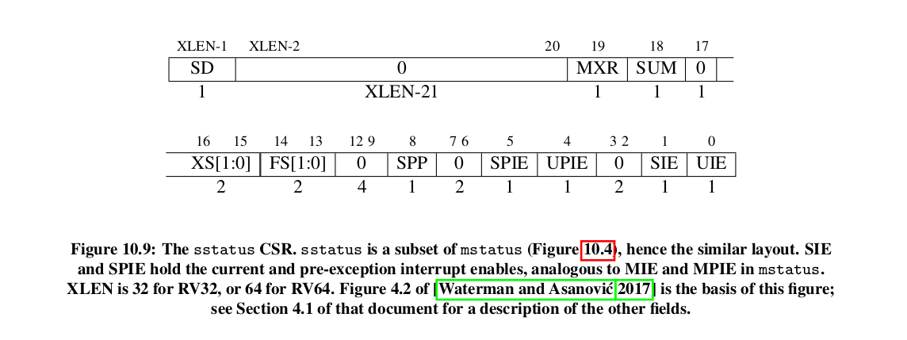

# Supervisor_mode_to_the_rescue

Now the Modes were once divided into User_mode and Machine mode only. The PMP system is a rockstar at isolating memory.  
But PMP was just not enough to support complex applications.... even 5!!!

So Supervisor mode was created, a mode where you have access to a Memory Paging system. So people usually implement their kernels on this mode.  

Under S-Mode...
1. You cannot call any M-mode instructions ie. mret.
2. You cannot access any M-Mode CSR. eg the mstatus register. However you get your own S-Mode registers eg sstatus register
3. You can ONLY access memory in accordance to th PMP configurations set by the Machine Mode configurations

## Interrupt and Exception Handling in S-Mode

By default, all exceptions and interrupts are handled in machine Mode. For example a Supervisor timer interrupt will get handled by the fuction found in mtvec. That function might sort the issue... or it might pass that problem back to the S-Mode interrupt handler. This is a lot of work.    

An OS usually has ways to sort out u-mode exceptions.   
Considering that an OS might be implemeted in S-mode. It is quite inefficient to let the U-mode exceptions cause the CPU to switch from u-mode to M-mode to S-mode and then back to M-mode.  
It would have been better if some exceptions and interrupts could just be passed to the s-mode without going through the m-mode.    

So the solution is to let the Machine mode delegate some handling responsibilities to S-Mode. You delegate Interrupts using the mideleg register and exceptions using the medeleg register.  

The SIE and SIP registers only activate the bits that correspond to the interrupts that have been delegated.    
If the exceptions that have been allowed through medeleg occur, those exceptions will get handled in S-mode.    
For the exceptioms that haven't been allowed through medeleg, they will be handled in Machine Mode first.   

Exceptions and interrupts are handled just like in M-mode. We have the same registers :
1. sstatus
2. scause
3. stvec
4. sie
5. sip
6. sscratch
7. stval
8. sepc

Here is the sstatus register    

## Using the Virtual Paging system
