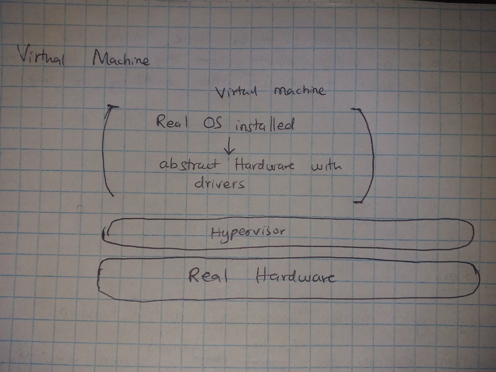

# VirtIO

[Main reference paper](https://docs.oasis-open.org/virtio/virtio/v1.1/virtio-v1.1.html)

***terms***

This definitions are described under the context of OS development. They may mean entirely different things under other contexts such as web development or cloud development. Moreover, there is no way to categorize software perfectly using words... for example person A may call Linux a full-fledged OS while another may call it 'just an advanced kernel'. Potato-potato

1. **A virtual machine** - A virtual machine is a software program that emulates a computer system. A 'computer system' in this case means (OS + drivers + hardware)
For example when creating an insance of a VM, you will first just name the number of CPUs you want... or the number of network cards you want... and anstract instances of those devices will be created. 
Second after, you will need to install a real OS on top of that abstract hardware.  

A virtual machine typically runs on top of virtualized hardware. VMs can be made to run directly on top of bare-metal but this is undesirable.  For this reason, a VM must run on top of a virtualizer software such as a hypervisor.  

Without the hypervisor or virtualization layer, a virtual machine would have direct access to the underlying physical hardware, just like any other application running on the bare metal. If you intend to run only one virtual machine then running on bare metal is possible. But if you intend to run multiple VMs then this would create a potential conflict for resource allocation and management, and could also create security risks, as different operating systems and applications could interfere with each other and potentially compromise the integrity of the entire system.

1. **A Hypervisor** - a hypervisor is a piece of software that runs on top of hardware. A hypervisor's main goal is to abstract the underlying hardware.  
In the context of virtual machines : The hypervisor is a layer of software that sits between the virtual machine and the underlying hardware, and it provides a level of abstraction that allows multiple virtual machines to share and utilize the same physical hardware resources.

So the hypervisor will abstract things like the CPU, network cards, Graphics, Harddisks etc.

### VirtIO
The VirtIO is a framework (standard set of communication protocols and interfaces).  
It is a framework that defines how the virtual machine interacts with the host environment. The Host environment can be a hypervisor, a virtualization software, another bare-metal OS or anything that virtalizes hardware.  

It was created to address the need for fast and efficient I/O (input/output) between virtual machines and their hosts.  
Before Virtio came through, people used to abstract hardware in full (virtualize all components and all commands).  
For example they would virtualize the whole motherboard...even devices that are not in Use.  
They would replicate everything down to the registers of the CPU. But we are in a virtual environment... why bring all that detail to our simple virtual world? 
They would replicate the entire APIs to those abstracted devices. Meaning that the same unique low level protocols needed to communicate with those devices get brought to our simple peaceful virtual world.  

As you can see, Before VirtIO, virtual machines used **emulated** devices to communicate with their hosts, which often led to slow and inefficient I/O operations. 

But virtio allows you to only abstract necessary devices. 
Each device has a simplified interface that might not be identical to the interface defined by the physical hardware. Virtualize devices... not emulate them. 
This two qualities make it suitable for our peaceful virtual world

With Virtio being made standard, it made VMs to be platform agnostic.

***How does Virtio work?***  

VirtIO defines a set of virtual devices that are *optimized for use in virtualized environments*. 
By optimized I mean that they have:
- Reduced overhead: VirtIO devices are implemented as software running in the host environment, so they can be designed to minimize overhead and reduce the amount of processing required in the virtual machine.

- Simplified interfaces: VirtIO devices use standardized, simple interfaces that are designed to be easy to implement and use. This reduces the complexity of communication between the virtual machine and the host environment, which can improve performance.

- Flexibility: VirtIO devices can be added or removed from a virtual machine as needed, without requiring any changes to the virtual machine itself. This provides flexibility and makes it easier to manage virtualized environments. 

These devices are designed to be lightweight and efficient, with a simplified interface that allows them to communicate directly with the hypervisor and other devices in the virtualized environment.

When a virtual machine is created, the hypervisor provides a set of these VirtIO devices to the virtual machine. These devices are presented to the virtual machine as if they were physical devices, but they are actually implemented as software running in the host environment.  

The virtual machine communicates with the VirtIO devices through a set of standardized interfaces, which are implemented by the hypervisor. These interfaces are designed to be simple and efficient, allowing the virtual machine to communicate with the VirtIO devices without incurring significant overhead.  

One of these virtio devices is the Block device.  
A block device is a storage device that returns data in blocks. It does not return data in a character stream

***Implementation***

The Virtio has 2 layers :
1. The front-end layer  - deals with the communication between VM and virtio devices 
2. The back-end layer   - deals with the communication between the virtio devices and physical hardware

The VM communicates with the virtio device using MMIO programming. Under virtio bus, there are a bunch if registers

The device and guest share a segment of physcal memory. This segment is used for communication purposes. This is where the virtiqueue is found.   
To pass along a message, you store that message in the virt Queue and press the GO (write 1 to the Queue notifier register). The device reads the message, processes it and writes the responce in the virtiqueue.  

The virt Queue is the main send/response structure.  
The Virtio virtual queue is a shared memory region used for communication between a Virtio device and its driver. It consists of three main components: the descriptor table, the available-ring, and the used-ring.

The descriptor table is an array of descriptors that describes the data buffers or commands that will be processed by the Virtio device. Each descriptor is a small data structure that contains information about a single data buffer or command. The descriptor typically includes a pointer to the data buffer, its length, and control flags.

The available-ring is another array of descriptors that are used by the driver to indicate which descriptors in the descriptor table are available for the Virtio device to process. Each entry in the available-ring corresponds to an entry in the descriptor table and contains a descriptor index and a set of flags.

When the driver wants to send data to the Virtio device, it updates one or more entries in the available-ring to indicate which descriptors are available for the device to process. The driver then notifies the device by writing to a special register in the Virtio device.

The Virtio device reads the available-ring to determine which descriptors are available for processing. It then processes the data buffers or commands described by the descriptors and writes completion descriptors to the used-ring.

The used-ring is the third component of the Virtio virtual queue. It is another array of descriptors that are used by the Virtio device to indicate which descriptors in the descriptor table it has completed processing. Each entry in the used-ring corresponds to an entry in the descriptor table and contains a descriptor index and a set of flags.

After the Virtio device has processed a data buffer or command, it writes a completion descriptor to the used-ring to indicate that the corresponding descriptor in the descriptor table has been processed. The driver reads the used-ring to determine which descriptors have been completed and can then free any associated resources.

Overall, the Virtio virtual queue provides a flexible and efficient way for a Virtio device and its driver to communicate with each other. By using a shared memory region, it avoids the overhead of copying data between different memory regions, as would be necessary if the device and driver communicated using I/O ports or other communication channels.

######  The Queue PFN (physical Frame Number)
The Queue PFN stores the physical address of the virtual queue in memory.  

The virtual queue itself is typically implemented as a data structure in the driver's memory, and the driver is responsible for mapping the virtual queue into physical memory so that the Virtio device can access it.  
When the driver initializes the Virtio device, it writes the physical address of the virtual queue into the QueuePFN field in the device's configuration space. This allows the Virtio device to access the virtual queue by reading and writing to the memory location specified by the QueuePFN field.

######  The QueueNum Register
The QueueNum register is another field in the Virtio device's configuration space that is used to configure the Virtio virtual queue. It specifies the number of virtual queue pairs that the device and driver will use to communicate.

A virtual queue pair consists of an available-ring and a used-ring, as well as the associated descriptor table. Each virtual queue pair is used for a separate stream of communication between the Virtio device and its driver.

When the driver initializes the Virtio device, it writes the desired number of virtual queue pairs to the QueueNum register. The Virtio device then uses this value to determine the size of the descriptor table and the available-ring and used-ring arrays for each virtual queue pair.

###### The Request block
The desriptors in the Vurtqueue point to the Request block.  
So the request Blocks are found in the Drivers's memory.  
They give information about the type of I/O operation the driver needs from the device.

The Request Block (also known as the "virtqueue descriptor" or simply "descriptor") is a data structure used in Virtio block devices to describe a block I/O operation that the driver wants to perform on the device. It is typically implemented as a buffer in the driver's memory, and is used to pass information about the I/O operation from the driver to the Virtio block device.

The Request Block contains several fields that describe the I/O operation, including the operation type (e.g. read or write), the starting sector number, the length of the data to be transferred, and a set of flags that control various aspects of the I/O operation.

When the driver wants to perform a block I/O operation on the Virtio block device, it creates a Request Block in its memory and initializes the appropriate fields with the desired values. It then adds the Request Block to the appropriate Virtio virtual queue by appending it to the available-ring and notifying the device using the appropriate mechanism (e.g. an interrupt or memory-mapped I/O).

When the Virtio block device receives a Request Block from the driver, it reads the necessary fields from the Request Block to determine the details of the I/O operation being requested. It then performs the requested operation and updates the Request Block with the results of the operation (e.g. the number of bytes transferred). Finally, it appends the updated Request Block to the used-ring of the corresponding virtual queue pair to notify the driver that the operation has completed.

The request block is this struct  with  (request header), (Data Buffer) and (status buffer)
    - request type (32bits) [IN(a read by driver), OUT(a write by driver), FLUSH, DISCARD, WRITE_ZEROES]
    - reserved (32 bits)
    - Request sector {
      - (tells us from which block to begin to read from in memory. Sector is a fancy name for 'block'. Block size gets set durin initialization of the device)
      - every sector has 512 bytes
    - The databyte [sector][byte_number] ---> The actual dat byte getting affected by this block I/O operation
    - The Status ---> This byte shows whether the virtio device succeeded or failed  or if the operation was unsupported.
      - this byte gets written to by the virtio device (o == success, 1 == error, 2 == unsupported operation)
      - at the beginning, make the driver write some arbitrary value such as x... that way we will know if the block device even did dare touch our block request 

The request block will be represented by 3 descriptors.  
    - Descriptor 1 (stored in the virtqueue descriptor array) - references the block request header. The "next" address points to the Descriptor 2 (that is stored in guest's memory instead of virtqueue)
    - Descriptor 2 points to Descriptor 3 and references data Buffer
    - Descriptor  3 references the status buffer of the block request
- All this in the name of modularity 

***In Qemu***
For the QEMU emulator, it puts virtio devices (backwards) from 0x1000_1000 to 0x1000_8000. If we only have one device, it should be attached at 0x1000_8000

