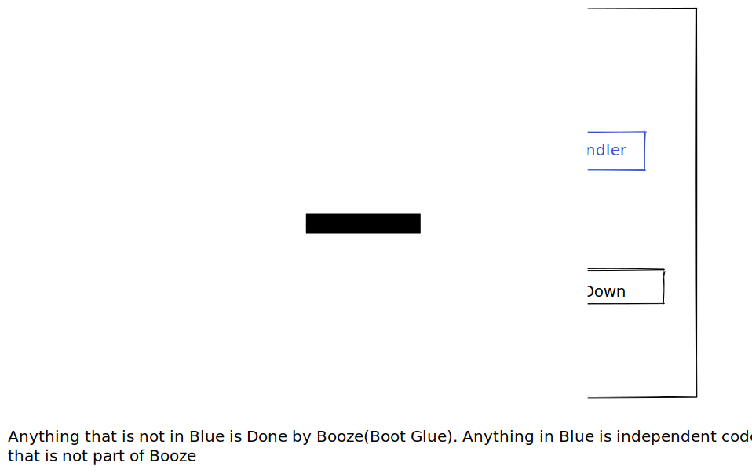
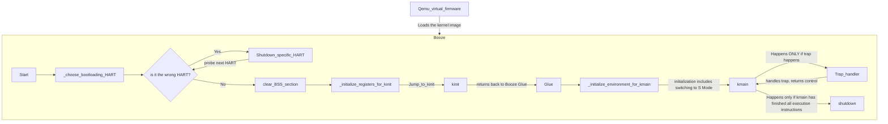

# Boot Design

The boot program is the one that is responsible for :
1. Setup the environment for the kernel to run in machine mode
2. Transfer the control to kinit() (kernel running in machine mode)
3. Designate a specific place where the CPU will jump to if a trap occurred when kernel is in either machine mode or supervisor mode.
4. Initiate an environment for the kernel to run in supervisor mode.  


* the boot code is the one that contains the _start function. _start function is the entry point for the whole kernel image. So it is the first place the CPU points to in the RAM after the Qemu firmware has done its thing.  

## Bird's View (ideal but not as implemented)
 ```mermaid
  stateDiagram
    load_firmware
    load_bootloader
    load_kernel
    run_kernel
    shutdown

    state look_for_bootloader <<choice>>
    state look_for_kernel <<choice>>

    [*] --> load_firmware
    load_firmware --> look_for_bootloader
    look_for_bootloader --> load_bootloader : Bootloader is found
    look_for_bootloader --> shutdown : Bootloader is missing

    load_bootloader --> look_for_kernel
    look_for_kernel --> load_kernel : Kernel image is found
    look_for_kernel --> shutdown : Kernel image is Missing

    load_kernel --> run_kernel
    run_kernel --> shutdown

    shutdown --> [*]

  ```

## Assembly Glue
Instead of the boot code being a program that gets called once(as seen above), it becomes the glue code that gets called whenever kinit and kmain go out of scope. It encompases the entire kernel. It acts as glue code.  



## Detailed Program flow



