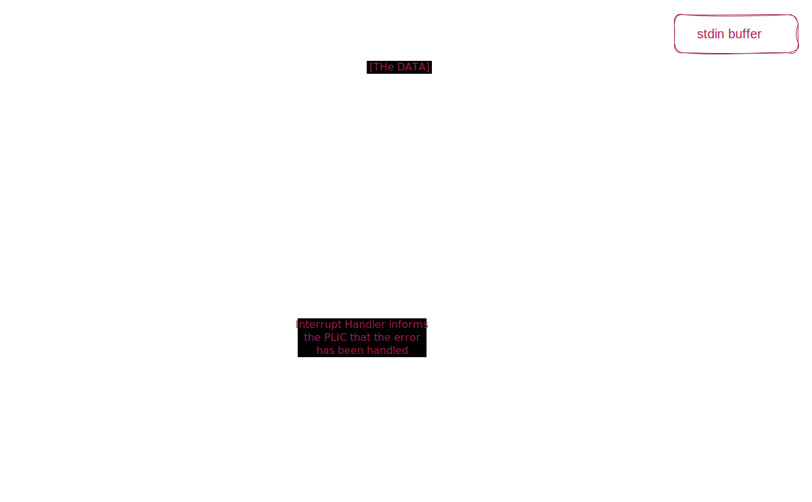
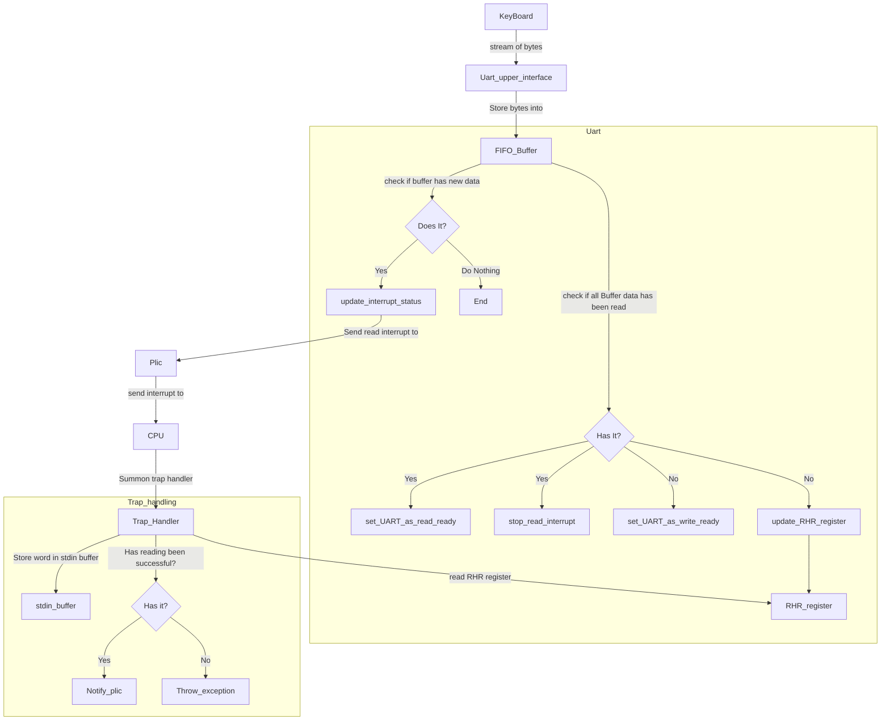

# Designs and layouts

## Birds Eye View 
  

## Keyboard Input - Level 0

## Keyboard Input - Level 1

```mermaid
flowchart TD

    KeyBoard -->|stream of bytes| Uart_upper_interface
    Uart_upper_interface -->|Store bytes into| FIFO_Buffer
    
    subgraph Uart
        FIFO_Buffer -->|check if buffer has new data| if_state{Does It?}
        if_state -->|Yes| update_interrupt_status
        if_state -->|Do Nothing| End

        FIFO_Buffer -->|check if all Buffer data has been read| if_state_2{Has It?}
        if_state_2 -->|Yes| set_UART_as_read_ready
        if_state_2 -->|Yes| stop_read_interrupt
        if_state_2 -->|No| set_UART_as_write_ready
        if_state_2 -->|No| update_RHR_register
        update_RHR_register --> RHR_register
    end

    update_interrupt_status -->|Send read interrupt to| Plic
    Plic -->|send interrupt to| CPU
    CPU -->|Summon trap handler| Trap_Handler

    subgraph Trap_handling
        Trap_Handler -->|read RHR register| RHR_register
        Trap_Handler -->|Store word in stdin buffer| stdin_buffer
        Trap_Handler -->|Has reading been successful?| if_state_3{Has it?}
        if_state_3 -->|Yes| Notify_plic
        if_state_3 -->|No| Throw_exception
    end


```

