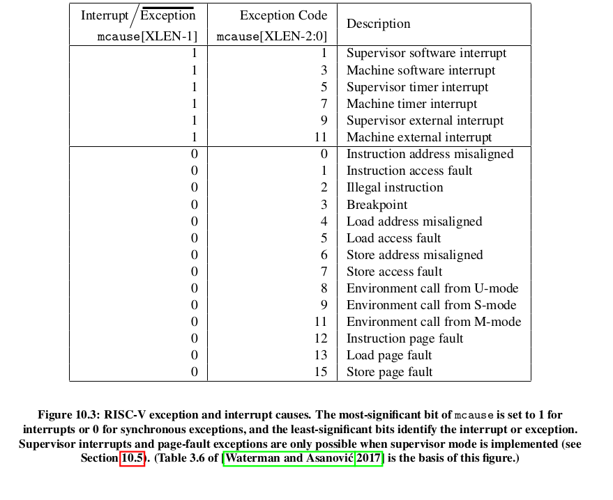
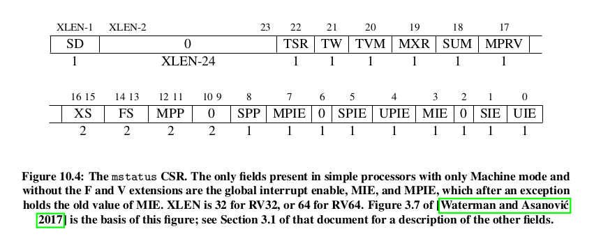
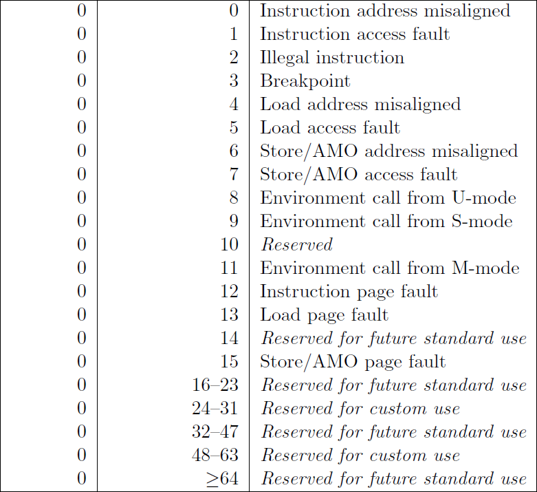

# Handling Exceptions and Interrupts in Machine Mode

Priviledged modes give you access to some registers that can be used to configure how the CPU deals with Interrupts and exceptions. 

First off let us define what exceptions are ... and how different they are from Interrupts.  

An exception occurs when the disturbance comes from the code that is currently getting executed. For example, if the current instruction tried to write to a read_only memory location, an exception will occur.   

An interrupt occurs when the disturbase does not come from the code executing in the subject HART. This disturbance might come from another HART or the PLIC... something external... something that is not the code running in the Subject HART.   

Riscv acknowledges the following Exceptions and Interrupts. You can add your own.  
   

The Exceptions are a lot. Let's just discuss the Interrupts :   
1. Software Interrupt - this is an interrupt that comes from another HART. An interprocessor Interrupt. This interrupt can come from a HART that is in Machine Mode or Supervisor Mode.
2. Timer Interrupt - this is an interrupt that comes from the time_comparator circuit. ie when the time found in mtimecmp register contains a value that is larger than the mtime register. THe Timer Interrupt might occure when the HART is in Machine Mode or S-Mode
3. External Interrupt - this is an interrupt that comes from the PLIC. The PLIC is receives interrupts from external devices such as keyboards or sensors

To Handle interrupts, you need to manipulate a few control registers :
1. **mstatus register**
2. **mie register**
3. **mtvec register**
4. **mcause register**
5. **mtval register**
6. **mip register**
7. **mepc register**
8. **mscratch register**

   

#### The Mstatus Register 
The mstatus Register is the first stop. You can use this register to set whether the CPU should be able to handle interrupts or not... across all modes.      
You can also store the previous interrupt enable status of all modes.   
This is like the main switch.   

Here is the structure of the mstatus register :

MPP stands for Machine Previous protection mode. This segment stores the mode_code of the CPU when the exception happened. The reason we need to store the previous mode is so as to help us return to the previous mode using the mret instruction.    
SPP stands for Supervisor Previous protection mode. This segment stores the mode_code of the CPU when the exception happened
Anywhere you see IE ... it stads for Interrupt Enable eg MIE --> Machine Mode Interrup Enable   

We have the MPIE field (Machine Previous Interrupt Enable). This stores the previous IE setting. You see when the CPU is handling an exception, it does not need any disturbances, so it sets MIE to 0 by default. Storing the previous setting will help us restore the context after the CPU has finished handling the exception.  

#### The MIE register
After allowing the CPU to accept Interrupts, you have to specify which interrupts you are willing to accept using the MIE register.  
We do not have to enable Exceptions ... exceptions just happen, we cannot ignore any exceptions.    
Each bit in the MIE corresponds to an interrupt (not an exception).  
The positions are in accordance to the mcause table :

For example, the MIE bit 7 represents the Machine Timer Interrupt   
Here is the actual structure of the MIE register :  

#### The MTVEC register (MTVEC--> Machine Trap Vector)
A vector is a function's memory address.    
This register stores the address of the exception/interrupt handling function. When the CPU receives an exception or an interrupt, it starts executing the code found in this address.

#### THe MEPC register  
This is where the CPU usually stores the Address of the instruction that caused the exception. So if you want the to know the instruction that caused an exception for the sake of debugging

#### The mcause Register
The Mcause register stores the ID of the exception or Interrupt.    
Here are the RISCV recognized IDs

You can use this info to identify which interrupt needs to get handled...

#### THe mtval register
This register stores the trap value. This is the additional info about the interrupt/exception. 

#### The mscratch register
This is a throw-away register to help you store temporary values. The mscratch register is attached to a buffer in memory. So you can use the mscratch register to store the context of the CPU before handling the exception/interrupt. This is to avoid data loss

#### mip
Machine Interrupt pending. Shows which interrupt are waiting to be processed

## The whole process

When an exception occurs...
1. The CPU stores the current PC to the mepc. But for interrupts, the next PC is the one that gets stored in the mepc
2. the PC is set to mtvec. 
3. msattus and mtval are updated accordingly
4. the CPU disallows further acceptance of interrupts by setting the MIE segment in the mstatus register to 0 and storing the previous MIE value to the MPIE.
5. The pre-exception privilege mode is preserved in mstatus’ MPP field, and the privilege mode is changed to M.

You need to make all error handlers to have a prologue where they save the context of the CPU pre-exception.    

## The mret function
The mret function does the following actions :
1. restores the previous mstatus' MIE field by reading from the mstatus' MPIE field
2. restores the CPU's PC to point to the value stored in the mepc register
3. restores the CPU to the Protection mode specified in the mstatus' MPP field.

All Interrupts and Exceptions are handled in Machine mode by default. But you can make the Supervisor Mode handle some exceptions and interrupts by using the medeleg and mideleg registers