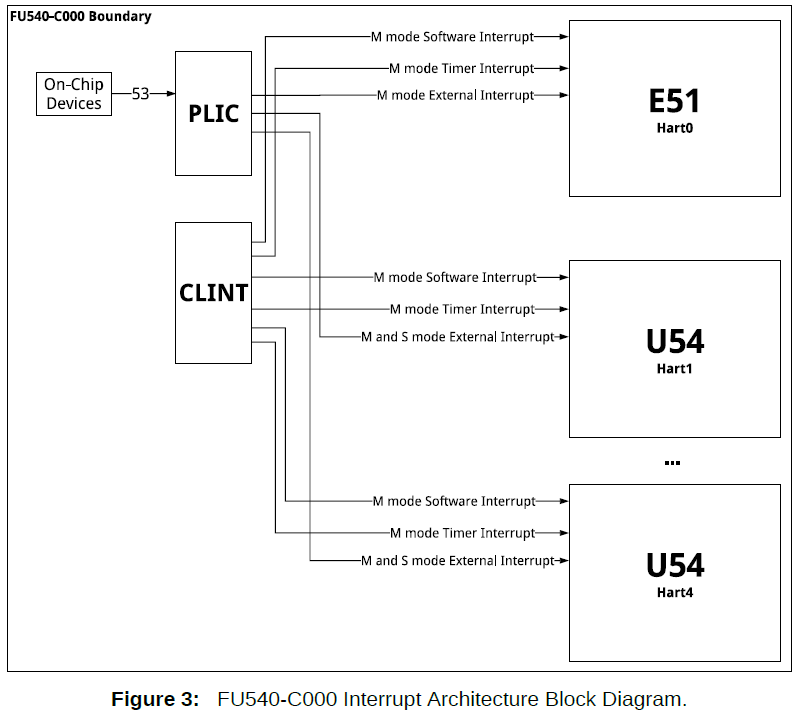

# external_interrupts

References :
- [1]: https://sifive.cdn.prismic.io/sifive%2F834354f0-08e6-423c-bf1f-0cb58ef14061_fu540-c000-v1.0.pdf#%5B%7B%22num%22%3A164%2C%22gen%22%3A0%7D%2C%7B%22name%22%3A%22XYZ%22%7D%2C0%2C630%2C0%5D
- [2]: https://github.com/qemu/qemu/blob/master/include/hw/riscv/virt.h

As earlier said, there are three kids of interrupts :
1. Timer Interrupts
2. Software Interrupts
3. External Interrupts

In this chapter, we talk about External Interrupts.  

External Interrupts are interrupts that come from other physical circuits that are not part of the subject core. With the exemption of the timer circuit (CLINT) AND other CPU cores.  
The timer circuit is exempted because its interrupts already have a more dedicated name : Timer Interrupts  
The other CPU_core circuits are also exempted because their interrups also have a more dedicated name : Software Interrupts.  

The UART circuit may send an interrupt to the CPU when its buffer is full. Now that's an external Interrupt.    
A sensor sending interrupts, A mouse... any external circuit that is not part of the core_processor circuitry.  

THe CPU/Core receives interrupt signals through dedicated pins called CPU_interrupt_pins. 

## THe Past
In the Past, each external circuit was connected a dedicated pin, as seen below
[undone]

But this meant that the CPU had to :
1. Have many pins
2. Co-ordinate how the different interrupts were managed. 

Managing interrupts means doing a combinations of the two actions listed below:  
1. Choosing which interrupts the CPU will ignore.
2. Setting the order of priority by which the interrupts will be sorted (if in case different interrupts happen simultaneously)  

## The Present Time

The past method had some inconveniences.    
1. That method required the CPU to have many pins. That may be expensive in terms of space and cost.  What if you have 100 external circuits? Are you going to make the CPU have 100 pins? Meeeeh that's too much fam.  
2. That method was too hardware-independent, it was inflexible. It was NOT modular. This point will become clearer when we compare it to the PLIC method in the next few lines. For now, take my word for it ha ha. Such fickle words.

THe PLIC method. 
   
PLIC stands for Platform Level Interrupt Controller. This is a dedicated circuit that is independent from the CPU. It is a circuit dedicated to receiving all external signals, managing those external signals and eventually supplying the CPU  with the sorted interrupts through a single dedicated pin.  

The word "Platform" in this case means (CPU circuit + the outside world).   
For example, a platform can be a motherboard or 

Here is a demo figure :
[undone]

### Advantages of the PLIC method
1. Now the CPU does NOT have to have to have baggage circuitry for managing the externl interrupts. THe CPU becomes more lean. 
2. You can swap out the PLIC circuit version/design without changing the CPU circuitry. This was the part where I was saying something about modularity. For Example, you may switch from a 20-pin PLIC to a 50-pin PLIC. Boom! you can now handle more external devices without changing the CPU circuitry.  
3. The CPU only needs at least one pin to deal with many external interrupts.  
4. You can have many versions of PLICs running on a single Motherboard. You may use a certain PLIC for certain conditions and another for other conditions. Who said only software needs to be modular? Who said hardware always has to be dedicated/fixed?  

The pin that connects the PLIC to the CPU is called the External Interrupt Pin (EI pin).  
You can disable this pin by setting the MEIE and SEIE bits in the MIE register.  
MEIE stands for Machine External Interrupt Enable   
SEIE stands for Supervisor External Interrupt Enable

Here is th interaction between the PLIC, the CPU and the CLINT

Each PLIC implementation is unique in its own way, there is no standard PLIC design.    
From here on, the PLIC being described is specific to Qemu.  

You can control the behavior of the PLIC through exposed registers.  
The PLIC has pins that are connected to the external circuits. According to [this Qemu source file][2], the UART is connected to pin 10 of the PLIC. The VIRTIO devices are attached to  1 through 8, and the PCI express devices are 32 through 35.  

## How to Control the PLIC
Full details of how the PLIC works and how you can control it can be found in [this Sifive Paper][2]. The PLIC described there is not the same as the PLIC used in Qemu, but the theory on what the different registers do is the same. The only difference is that the memory mapping implementation is different. That is 100% inconsequential to the functioning theory of the PLIC.  

The functions of the PLIC remain the same :
1. Receive interrupts from many external sources
2. Filter certain interrups by ignoring some of them and accepting others.  
3. Sort the accepted interrupts by their order of priority and put them in a pending array
4. Allow the CPU to fetch the pending interrupts.  

The PLIC exposes regiters that help the programmer to execute and monitor the above functionalities.    
The register are :
1. The Buffer Register - claim/complete register combined  
2. The pending register
3. The threshold register
4. The Enable Register
5. The priority register

We will cover the use of each register in the next section

### 1. Receiving Interrupts
Each PLIC pin is connected to an external circuit. Each pin has a unique number or ID. For example pin 10, pin 20...    
The number of pins is equal to the number of external circuits that the PLIC can receive.  

An interrupt ID is a fancy name for Pin Number. For example, the Interrupt ID for a UART[0] buffer read is 10.  

You can choose to ignore some external circuits. Instead of physically detaching those circuits from the motherboard, you can disable the PLIC pins connected to those devices.  
To disable them, you have to modify the bitmap found in the Enable Register. The enable register contains an array of bits that corresponds to the Interrupt Ids. For example, to disable pin 10, I will write 0 to the 10th bit of the **Enable Register**.    

### 2. How to modify Priority ordering
One of the functions of the PLIC is to sort the pending interrupts by their level of urgency.  

Each Interrupt ID has to be associated with a priority value.  
A priority value helps the PLIC organize the pending interrupts by their level of urgency. The more the priority value, the more the level of urgency.  

Priority value ranges from 0-7. If the priority value of an interrupt is 0, the PLIC should ignore that interrupt and DECLINE putting that interrupt in the pending list. That interrupt does not deserve to even get sorted, it is acknowledged by the PLIC but it is never presented to the CPU.  

If interrupts with the same priority occur simultaneously, the interrupt whose ID is lower is given more priority.  

The **priority register** is an array of memory units. The number of this units corresponds to the number of each pin. So if I want to set the priority of the interrupt coming through pin 10 to have priority 2, I will write 2 in the priority_regiter[10] memory address  

The **Threshold register** stores the lowest priority value that your PLIC will NOT tolerate. For example, if you want to ignore all interrupts with priority values that are less than 2, you will set the threshold to 1.  
As you might have guessed, the default value of the threshold is zero. You are free to change it. If you set it at 7, it means all interrupts will not get sorted by the PLIC... they will be ignored.  

### 3. Fetching The Interrupts from the PLIC.
After the PLIC sorts the Interrupts, it stores then in the **Pending Register**. The Pending Register is also an array of bits that mirror the PLIC pins. If a pin receives an interrupt signal, the corresponding bit in the pending register is chaged from 0 to 1.  
From this format, the ordering is sorted automatically, no fancy circuits get involved. 

The CPU can then parse the Pending Register procedurally. If a bit is set to one, it calculates the offset to determine the interrupt ID implied.  
The PLIC automatically picks the highest priority Interrupt ID from the pending register and stores it in the Buffer Register. So you don't have to waste time parsing the pending register. The pending register can help you know how the number and type of interrupts that are pending.  

To fetch the actual interrupt ID, you read from the **Buffer Register**. After you have read it and handled it, you have to notify the PLIC that that interrupt should no longer be considered pending. 
To notify the PLIC to remove the interrupt from the pending list, you write the same Interrupt ID back to the Buffer Register. If the PLIC detects that the ID being written by the CPU is the same as the one in the Buffer... it removes it from the buffer and uploads the next pending priority ID.  

If you write the wrong Interrupt ID, nothing will happen. Bugs will haunt you. Boooo hoooo sooo terrifying.... ooooh I'm scared oooooh 😂. On a serious note, this will cause bugs, watch out.  

Just do what you want, everything else is irrelevant.  
So what if you end up homeless? so what if you fail at things you don't care about? What is so awful about falling short of societal standards? So what if you end up poor?  
Life is pointless, it is depressing to not do what you want. It is depressing to do things out of fear or obligation.  
It is depressing to be 'responsible'.  
Just do what matters to you, what you think is important. everything else is a waste of time and useless.     

Fun and curiosity first. Everything else is noise, including responsible actions.  

