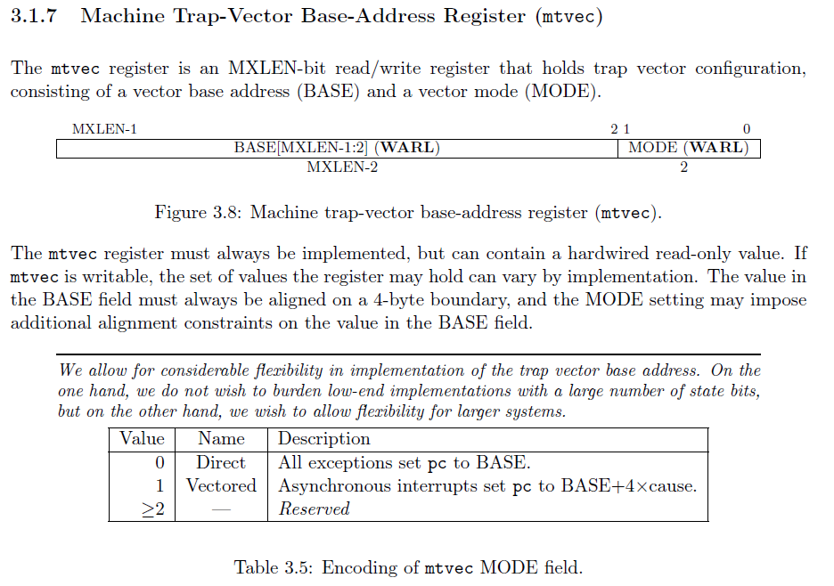
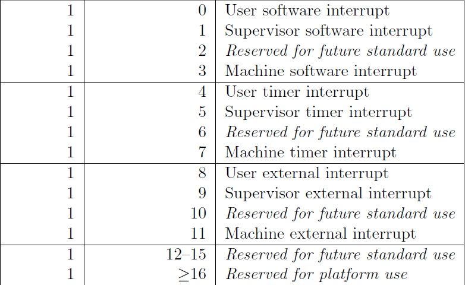

### what is an interrupt?
### What is a trap?
### How is a trap handled?
### How is an interrupt handled?

## RISC-V Interrupt System
The riscv system allows you to handle traps in all the CPU modes : usermode, supervisor mode and machine mode.  
But our system will handle all OS interrupts and traps in machine mode..  

When an interrupt happens, the cpu : 
1. updates the mcause register
2. updates the mepc register
3. updates mtval register 
4. saves the context of the current program 
5. calls the interrupt handling function.  
The address of the interrupt handling function is stored in the mtvec register (Machine Trap Vector). A vector is a fancy word for saying "pointer to a function"

We will use Direct mode of handling interrupts, we wil not use the vectored approach.  
Below is the the structure of the mtvec register :  

THe mcause register store information about :
1. The type of interrupt (whether it is synchronous or asynchronous)  0 == Synchronous, 1 == Asynchronous
2. The code specifying the cause of interrupt eg code 12 == instruction page fault

we will handle rhe flow of interrupt handling using the following files :
1. trap.s
2. 
## Rust function to handle Interrupts
inputs : 
    1. mcause : helps us determine the type and code of the interrupt
    2. mepc   : helps us determine the latest value of the program counter
    3. mtval  : some error handling functions need the matval eg in a page fault, the mtval registe contains the address of the faulty page
    4. 

Output : the program counter to the next instruction after the error handler has done its thing

Steps :
    1. Check if the interrupt is synchronous or asynchronous. We divide this way for modularities sake. Also it is a standard convention.
        - If the interrupt is synchromous, go to step 2
        - If the interrupt is asynchromous, go to step 6
    2. Extract the cause code from the mcause
    3. Make the return address point to the mepc... since this was the latest program counter
    4. use a switch to call specific error handling functions based on [table x](#table-x)
    5. return the updated program counter
    6. Extract the cause code from the mcause
    7. Make the return address point to the mepc... since this was the latest program counter
    8. use a switch to call specific error handling functions based on [table y](#table-y)
    9. return the updated program counter

###### Table x

###### Table y
