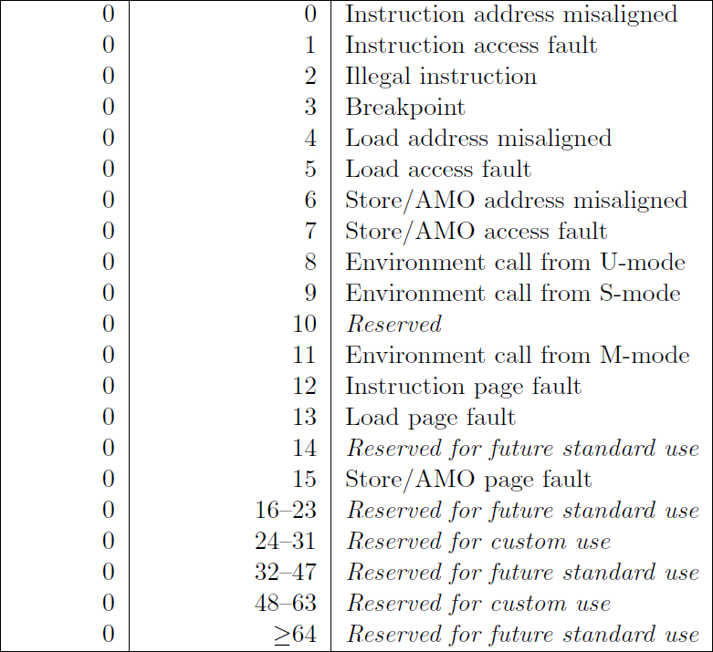

# Handling Interrupts and Traps

#### Terms

An **event trigger** in this case means the action of an instruction causing the CPU to stop executing the current process and start executing the interrupt handler.    

An **Interrupt** is an *event trigger* caused by an external device. This trigger is asynchronous (random).   
A **Trap** is a *deliberate* event trigger that is found in the program getting executed by the CPU. For example, a deliberate system call to access the file system.  
An **exception** is a *random* event trigger caused by the program that was being executed by the kernel. For example, a division by zero.  

Some event triggers are **synchronous**, meaning that the currently executing instruction is the one that caused the event trigger... whether is was done deliberately or randomly we don't care. 

Other event triggers are **asynchronous**, meaning that the event trigger was not caused by the currently executing instruction. It was caused by something other tan the currently executing instruction

Here are the asynchronous triggers :

Here are the synchronous triggers :

In RiscV, if the CPU receives an interrupt or trap or exception, the CPU switches to MACHINE MODE. After switching to machine mode, it starts executing the function pointed to by the MTVEC. This function being pointed to is the interrupt handler.

The MTVEC stores a physical address. Not a virtual address. In Machine mode, memory accesses are through physical memory addresses.  

Here is the layout of the MTVEC :   

As you can see the mtvec has two fields : The Base and the Mode. The Base stores the physical address of a handler function. The Mode specifies whether the interrupt handling mechanosm is direct or vectored.

**Direct Mode** 
Direct mode means that the address found in the Base is the root handler function. And that if the CPU receives any interrupt it will always point to that address only. The address points to one error handling function that stipulates how each interrupt is handled.   

**Vectored Mode**   
Under this method, the CPU first determines the cause of the interrupt and then calls a specific error handling function. It achieves this by calling the funtion at address : (Base_address + 4 x Cause_code)

A direct mode mtvec means that all traps will go to the exact same function, whereas a vectored mode mtvec will go to different functions based on what caused the trap. 
For simplicity, we will use the Direct Mode, It is not nice to mess around with physical addresses when its unnecessary.    

Considering the mode field uses 2 bits, we have to make the BASE address have two dispensable zeroes at the end. Meaning the BASE address needs to be aligned to 4.

1. 

