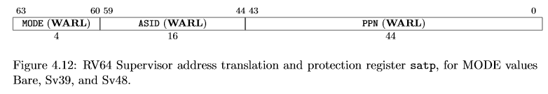

# Handling_the_Physical_MMU

Developing the Virtual MMU turneed out harder than expected. We had to figure out how to :
- Create a custom Page translation table
- Make the CPU consult the MMU every time the CPU executes an instruction
- Design our own page fault mechanisms.

It is better to just use already made hardware. We get a performance boost. We get to use a standard method of handling transltion, a method that is tried and tested. Designing a custom MMU was hard... we failed but.. Well, we learn a lot... moving on.

We need to cover the following tasks :
1. Page allocations
2. Page deallocations
3. Program the Memory Management unit
   1. Handle Mapping Virtual Adresses to Physical Addresses.
   2. Handling Page Faults
   3. Handling page Translations during CPU instruction executions.

## Page allocation and deallocation

As discused earlier, we will be allocating pages from the heap of the RAM. Each page is 4096 bytes long. And each page has a descriptor that describes the page status. Each descriptor is 1 byte long. The number of descriptors is equal to the number of pages found in the head. The descriptors are stored in an array found in the kernel code. The array of descriptors is not part on the heap. 

The Heap is virtually divided into 2, The kernel Heap and the User Heap

### Allocation Algorithm

algorithm : alloc
inputs to alloc : the number of free pages required a user process or the kernel(required_pages)
Outputs to alloc : the address of the first page of a contiguous block of free pages (starter_address)
main goal : return an address to the first page of a free contiguous set of pages  : A RESULT VALUE (pointer(usize)/ error)

Steps:
1. Confirm that the number of required pages is more than zero.
   1. If number is zero or less
      1. Throw an [Error M1](./errors#error_m1.md) to show that the allocator was given a zero.
      2. Return the error to the calling function.
   2. If the number is more than zero... continue to step 2
2. Traverse the array of descriptors found in the kernel code.
3. Try to Find a block of contiguous free pages
   1. If you find a block... skip to step 4
   2. If you traverse the whole array and you do not find space ... skip to step 5
4. Do the folowing :
   - update the descriptors that represent the block
   - return the pointer to the first page of the block
5. Do the following
   - return an [error_M2](./errors#error_m2.md) indicating that there is no free contiguous space.

### Deallocation Algorithm

algorithm : dealloc
inputs to dealloc algorithm : the address of the first page of a contiguous block of pages that needs to be freed (starter)
Outputs to dealloc algorithm : The Result Type (Ok/Error)
main goal : deallocate 

Steps:
1. Check if the starter address is valid or not.
   - If the starter address is a null pointer... go to step 2
   - If the starter address is an out of range address... go to step 3
   - If the starter address is a valid address...go to step 4
2. Return a Result_Error showing that the process tried to deallocate a null pointer : [Error_M3](./errors#error_m3.md)
3. Return a Result_Error showing that the process tried to deallocate a non-existent memory location : [Error_M4](./errors#error_m4.md)
4. Loop through the allocated block page by page :
   - For every page...
     - clear the data by zero-ing the bytes within the page
     - Change the status of the corresponding descriptor to 'empty'
5. After the loop, return a successful message Result (ok) type


## Programming the Memory Management unit

The instructions in the Elf files of programs typically reference virtual addresses. The CPU cannot execute an instruction that has a virtual address. For this reason, everytime the CPU encouters a virtual address in an instruction, so the CPU uses the MMU ciruitry to translate the virtual address into a physical address.  

You can program the MMU to enforce access rights to certain physical memory addresses, such that a translation will fail if an access right is being violated. If the translation fails, a page fault is thrown by the MMU and the interrupt handler handles it. In this case, the MMU acts as a memory protector, ensuring translations only happen when all access rights are adhered to.     

In Machine Mode, RISCV provides a mechanism of protecting memory called Physical Memory Protection(PMP). But PMP does not scale well.

A virtual Memory Management system is provided In Supervisor mode
- leaf node


### SV39 system


Terms : 
1. The Virtual Address 
2. The Physical Address
3. The Page table Entry (PTE)


A page table contains 512 PTEs. ie (2^9) entries
Each PTE is 8 bytes long. Which means the table occupies (512 x 8)bytes = 4096 bytes    

Rust:   
- map
- unmap 
- Translate

Abstract a table entry  
```rust
pub struct Entry {
	pub entry: i64,
}


```

Abstract a translation table
```rust
pub struct Table {
	pub entries: [Entry; 512],
}
```

### Mapping function    

inputs : 
    - mutable Root_table (we will update the root table)
    - Virtual address meant to be mapped
    - Physical address to be mapped
    - protection bots (flags)
    - the level of page table (by default 0)

No outputs

- Make sure the bits are not zero. Zero means that the entry is a branch. we want a leaf.
- Extract the VPNs (3) from the virtual address
- Extract the PPNs from the Physical address
- Access the root table
- Use the VPN[2] index to access the entry table in the root (mutably) - call this entry x
- Check if the x points to a valid memory
- If No
  - allocate a new page, store the page address at addr_1
  - update the entry x
    - store addr_1 into x
    - shift x to the right by 2 bits
    - add the valid bit in the LSB
- If yes, store the address of the next table at addr_1
  - Remove the valid bit from the copy value of x
  - Shift the x by 2 bits to the left
  - store this value into addr 1
- Use the VPN[1] index to access the entry table in the Table_1 call it entry y
- Check if the y points to a valid memory
- If No
  - allocate a new page, store the page address at addr_2
  - update the entry y
    - store addr_2 into y
    - shift y to the right by 2 bits
    - add the valid bit in the LSB
- If Yes
  - Remove the valid bit from the copy value of y
  - Shift the y by 2 bits to the left
  - store this value into addr_2
- Use the VPN[0] index to access the entry table in the Table_2 whose address is addr_2 - call it entry z
- Create an temporary entry called PHYSICAL
- Store the PPNs in it
- Store the Flags in it, make it valid
- store it at Table_2 VPN[0]

Use a loop in the future... this was just for clarity


#### Unmapping
You can unmap a specific irtual address. Work this algorithm out.       
You can also unmap the whole system, like the way stephen did. But this is undesirable.

#### Translating
This function takes in a virtual address and returns a physical address. If things go wrong, it may throw a page fault or return (None) to notify you that such a translation does not exist.

Inputs : 
- Root_Table as read
- Virtual_address as read_only

Outputs : Option<address>

- extract each part of the VPN from the virtual address as VP1, VP2 and VP3
- access the root_table
- access the target entry in root using index VP2
- Enter a loop that traverses PTEs starting from the root table
  - read the target PTE
  - check if it is valid, else throw a page fault
  - Check if the entry is a branch or a leaf
  - If the entry is a branch, continue traversing
  - If the entry is a leaf
    - extract the offset from the virtual address
    - extract the physical address by 
      - shifting entry to the left by 2 bits
      - Clearing out the last 2 bits
      - ANDING the offset to the page physical address 
- If you reach this point, it means you have not found a translation, return (None)


Now the kernel is currently using the physical addresses. TO turn the MMu on, you set the SATP MODE field to 8. 
But if we turn the MMU ON , Both the kernel and user processes will be forced to use virtual addresses ONLY. This means that we have to MAP all existing memory addresses befor we turn the MMU on. 
So we will map the kernel elf sections, kernel stack, required MMIO addresses.  
As a result, the kernel code meant to run in machine mode will also run in Supervisor mode

To make things easy, we identity map the virtual addresses and Virtual addresses. This means that for non_user addresses, there will be no time wasted on translation

#### identity mapping a range of functions
The goal is to map a couple of pages at a time. Pages that have not been mapped will not be accessible. So if there is any page that has elements inside, it needs to get mapped. For example kernel_data_section is found in a certain page, we don't care if it is in the middle or at the start of a page... bottomline, that page needs to be mapped.   
All page start addresses are aligned to 4096. That is why we defined the allign function. However the align function ony returns a multiple value that is greater or equal to the input value.

Algorithm : map_pages_in_a_range
inputs :
    - the mutable root table
    - The start known address
    - The End known address
    - The security flags

No outputs

- Find the true start_address of the page that contains start_known_address  : Call it true_start
- Find the true end_address : this is the address of the next page that has not been touched by the End known address
  - You can get this address by using the 'align function' on the End known address.
- Calculate the number of pages that are found within true start and true end, this number of pages will help us in the looping process of mapping mapping.
- Loop for each page that needs to be mapped
  - For each page : page::map(root, memaddr, memaddr, bits, 0);
  - increment the memaddr by 4096


Sometimes mapping may overlap, but that will cause no harm, because our mapping function only maps pages that have not been mapped. If it meets a mapped page, it moves along[undone]

Then we map all the setions and UART mem addresses : ORDER  
1. Export global data from Linker and bring them to Rust
2. Initialize Page allocation system
3. Allocate the Root table in the Heap. We could have defined a predefined array table in our code. But if we did that , the memory address of the array would be hard to pinpoint. For this reason, we just use the heap, where we can know the exact page and address that the root table occupies. (4096 bytes, 512 entries)
4. Update the SATP register ... (without turning it on). Here is the SATP Layout :
   - insert the 44 bit PPN in a abstract SATP (usize)
   - Insert the mode bit (setting the mode bit does not automatically turn the MMU on out of the blue, this mode bit will work only id we are in supervisor mode)
   - To actually switch from Machine mode to Supervisor mode, you have to modify the SPIE and MPP fields in the mstatus register. Afterwards, you call mret to restore the MPP, SPIE and update the PC register to point at the MEPC value.
   - Use inline web assembly to modify the real SATP : asm!("csrw satp, $0" :: "r"(satp_val));



* you can store your translation tables anywhere, I chose the heap
* The SPIE bit in the sstatus or msstatus indicates whether supervisor interrupts were enabled prior to trapping into supervisor
mode.