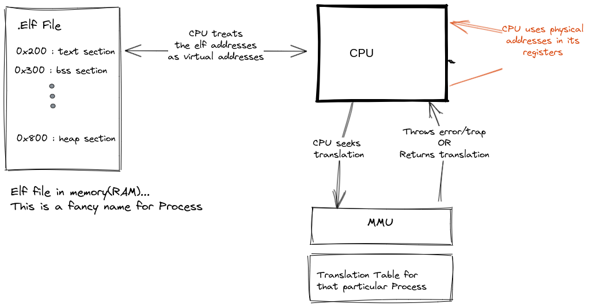

# Designs

## Birds View - Which memories are being dealt?

## Abstraction of the RAM
  

## Heap Abstraction
The Heap has been divided into 2 sections.  
A part dedicated for the Kernel heap allocations and a part dedicated for loading user programs  
Each user program can grow their heap.  

## Paging
The Page Manager uses descriptors to keep track of allocated and free pages.    
The Page manager can help you allocate or deallocate a cotiguous group of pages. Each Page is 4096 bytes large.  
Memory initialization is the process of demarcating the heap into balnced Descriptors and Pages.  

### Descriptor Ordering
 

### Wrong orders

### Paging Process

## Byte allocation
Byte allocation happens within the Page. A linked List is used to keep track of which bytes have been allocated

## Virtual Memory Protection

### The Page Table organisation

