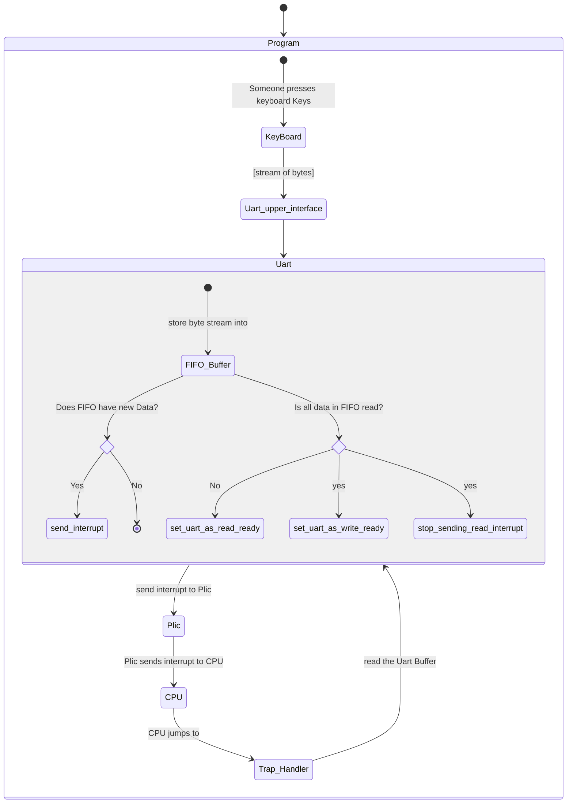

# Mermaid JS

Mermaid lets you create diagrams and visualizations using text and code. Read about it [from their official website](https://mermaid.js.org/intro/)     


## Integrating mermaid with mdbook
[undone]

### State diagrams
>"A state diagram is a type of diagram used in computer science and related fields to describe the behavior of systems. State diagrams require that the system described is composed of a finite number of states; sometimes, this is indeed the case, while at other times this is a reasonable abstraction." Wikipedia

Find instructions on drawing state diagrams [on this page](https://mermaid.js.org/syntax/stateDiagram.html)  

- define states (with or without descriptions)(with or without aliases)
  eg 
    1. simple states without descriptions or aliases :
    ```mermaid
    stateDiagram
        start
        running
    ```

    2. simple states with descriptions
    ```mermaid
    stateDiagram
        start : The bootloader has loaded the kernel image onto the RAM
        running : the kernel runs in Machine mode
    ```
    3. states with descriptions + aliases
- Define Transitions
    ```mermaid
        stateDiagram-v2
          s1 --> s2: A transition
    ```

- Nested states, sub_modules, notes
    ```mermaid
        stateDiagram
            s1
            s2
            s3
            [*] --> s1
            s1 --> s2
            s2 --> s3
            s3 --> [*]

            state s3 {
                [*] --> t1
                t1 --> t2
                t2 --> [*]
            }

    ```

    ```mermaid
        stateDiagram-v2
    [*] --> First
    First --> Second
    First --> Third

    state First {
        [*] --> fir
        fir --> [*]
    }
    state Second {
        [*] --> sec
        sec --> [*]
    }
    state Third {
        [*] --> thi
        thi --> [*]
    }
    ```
- Choices (if else/ match)
  - define the choice node
  - define th transition conditions
  
  ```mermaid
  stateDiagram
    load_firmware
    load_bootloader
    load_kernel'
    run_kernel
    shutdown

    state look_for_bootloader <<choice>>
    state look_for_kernel <<choice>>

    [*] --> load_firmware
    load_firmware --> look_for_bootloader
    look_for_bootloader --> load_bootloader : Bootloader is found
    look_for_bootloader --> shutdown : Bootloader is missing

    load_bootloader --> look_for_kernel
    look_for_kernel --> load_kernel : Kernel image is found
    look_for_kernel --> shutdown : Kernel image is Missing

    load_kernel --> run_kernel
    run_kernel --> shutdown

    shutdown --> [*]


  ```
- Forks/merges [undone]
- Concurrency [undone]


