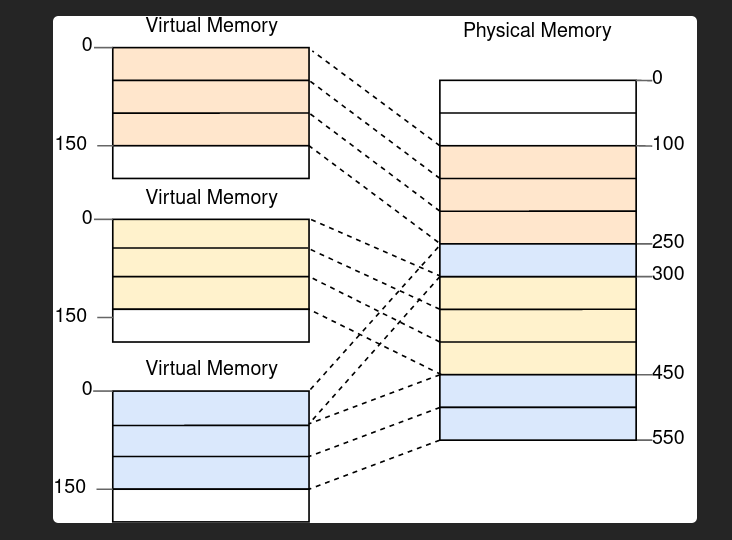
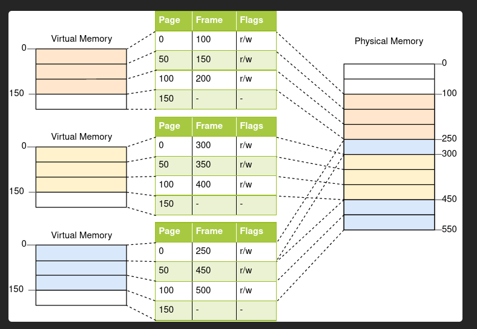

# paging

Paging says : Divide the virtual address space into very tiny blocks called pages. Divide the physical memory into tiny blocks too, called frames. Make sure that a page can map to a frame. Each page can be individually mapped to a frame, which makes it possible to split larger memory regions across non-continuous physical frames.  

And here goes.... No defragmentation needed because physical memory allocation need not be done massively contiguously. The size allocations are small, so they can fill fragmentation holes,   

## Page Tables
We end up having millions of pages that can be individually mapped to individual frames.  
This mapping information is stored in a page table. The CPU motherboard may provide physical hardware that implements these Page tables... OR you can implement the page tables on your own using code. 

Here is a visual representation of Page Tables :

From the Image, you can see that the individual Programs just get allocated pages in a contiguous fashion... they just get pages that are indexed procedurally. And those virtual page indexes are infact identical to virtual page indexes used in other programs.     
Just like how variables are only meant to be unique within a scope, virtual page addresses only need to be unique only within a program.  

Each progam is isolated from all other programs. So it is an isolated scope.    
Each program gets a Page Table that contains information about how each used page maps to a frame. You can also throw in the Access_flags to the Page Table if you want to.  

So the OS has to store the Page Table index associated with each process.   
When the CPU needs to execute a process, it must use the specific Page table associated with that process.

