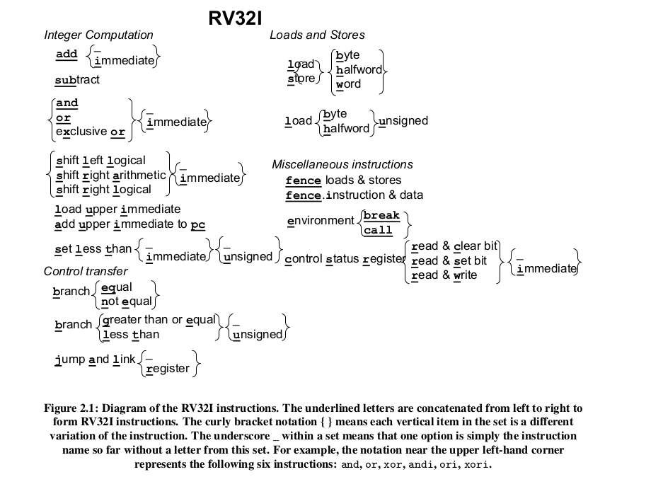
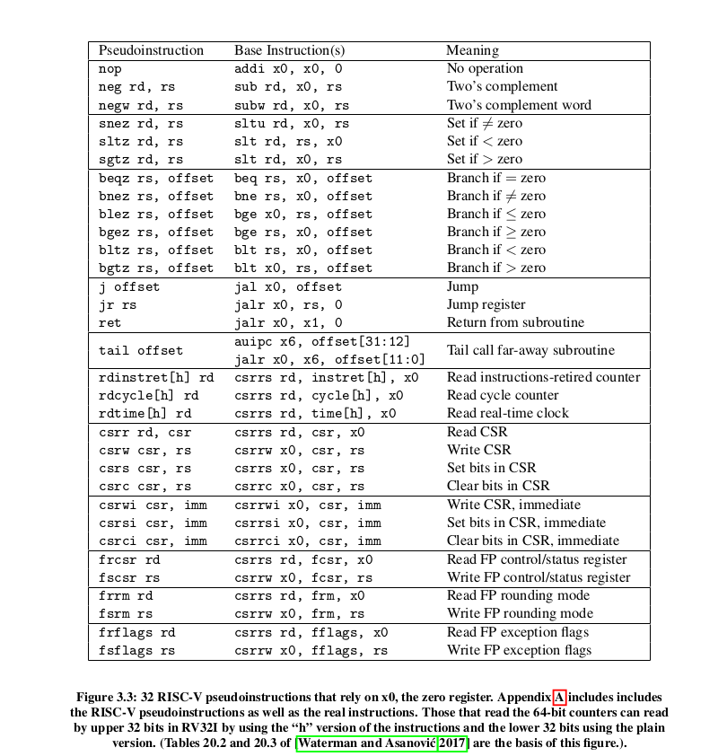
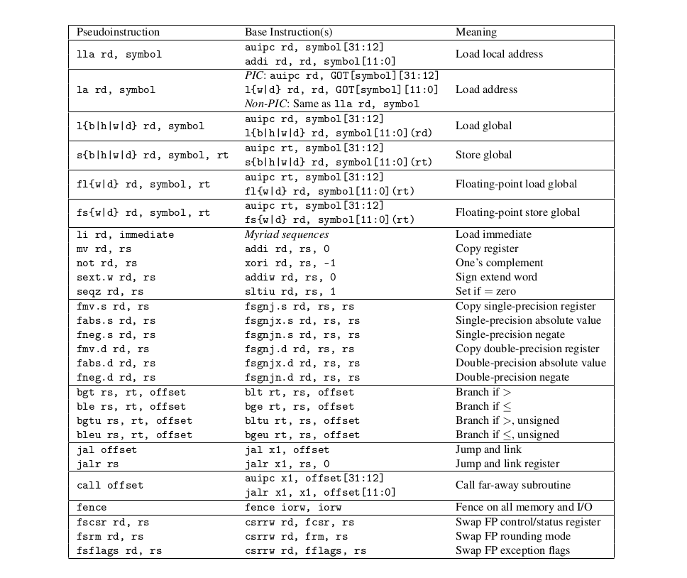
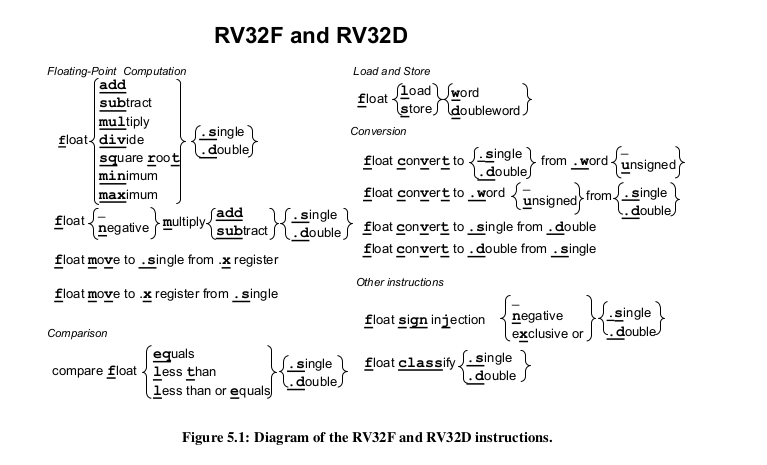
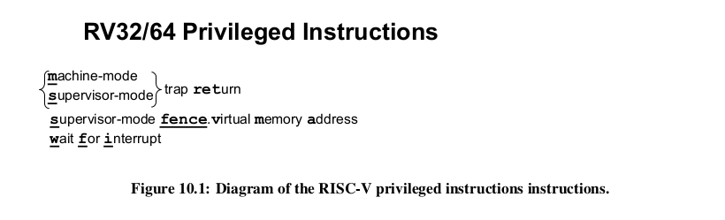

# priviledged_architecture

The assembly language provides sysntax on general instructions. Instructions that any sane program can call.    
The instructions are in modules.  

There is one module of instructions that is important. This module contains basic instructions that are quite ...well... basic.  
You may never prefer to destructure them to simpler commands.   
This module is called : The BASE module.    

It is agreed upon that the BASE Module is not to be changed, and that every implementation of RiSCV should be able to implement each of the BASE module instructions.   

Suppose you want to create a new set of application specific instructions, you will have to create a new module for yourself. And all the instructions you write should build up on the BASE module instructions.   

###  Illustration

The BASE Module contains only 47 instructions. Any program can be broken down to assembly code that uses a combination of only these 47 instructions    

Here is a representation of these 47 instructions :  

But you can't always write assembly code from scratch, using this basic intructions... so people came up with pseudo_instructions.  

Here are the pseudo_instructions and an illustration of their corresponding combinations of Base Instructions:

If you add an extension, more extension-specific instructions get added. For example, Adding the Float extension adds the following instructions in addition to the 47 Base Instructions.   

### Moving on...

Now the above instructions can be used to implement any piece of software. But these instructions are available in all priviledge modes {user, supervisor, machine}.  
Supervisor and Machine mode contain a few more instructions that are not found in the User mode     

More-privileged modes generally have access to all of the features of less-privileged modes, and they add additional functionality not available to less-privileged modes, such as the ability to handle interrupts and perform I/O.    

Here are all the added priviledged instructions :

Going into either of the priviledged mode gives the HARt the power to access all memory, , I/O, and low-level system features necessary to boot and configure the system.

