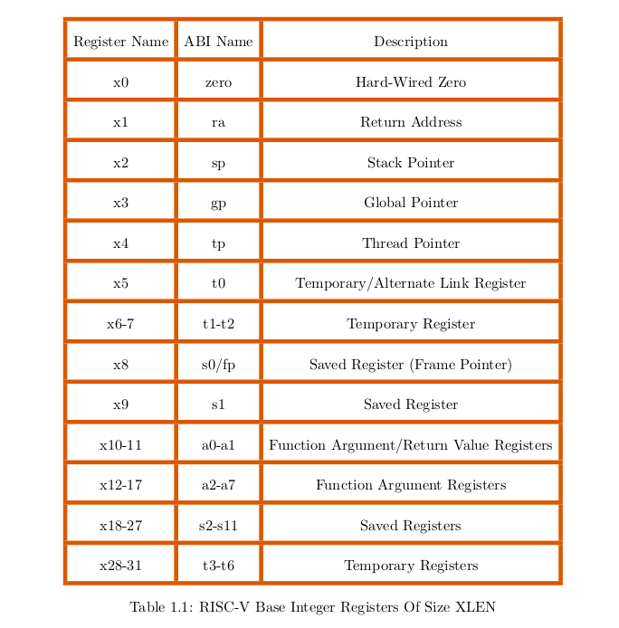
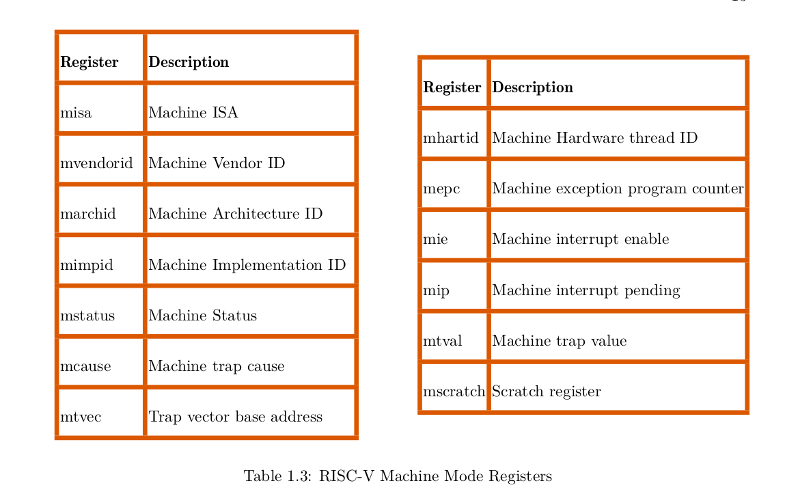

# Riscv_registers

References :
- [Riscv manual - by SHakti deelopment Team](https://shakti.org.in/docs/risc-v-asm-manual.pdf)

Types of registers : 
    - control and status registers
    - General purpose registers

extract : "RISC-V is divided into different categories based
on the maximum width of registers the architecture can support, for example, RV32 (RISC-V 32)
provides registers whose maximum width is 32-bits and RV64 (RISC-V 64) provides registers whose
maximum width is 64-bits. Processors with larger register widths can support instructions and data
of smaller widths. So an RV64 platform supports both RV32 and RV64"

RISCV has 3 privilege levels : User, Machine and Supervisor level.  
Each level has its own set of control status registers for manipulation and observation of the CPU, meaning each level has its own way of controlling the CPU.  

RISCV provides 31 read-write general purpose registers. (x1 upto x31)    
x0 is a read-only register that has the value zero hardwired to it. You can use it to set other registers to zero.  

However, there is a RISCV ABI convention. Even if the registers are general purpose, they are typicallly used as follows ;

x1 == the return address

*x2* - used as a stack pointer; it holds the base address of the stack. In addition, stack base address must aligned to 4 bytes. Failing which, a load/store alignment fault may arise. 
The x2 register can hold an operand in the following ways:
1. As a base register for load and store instruction. In this case, the load/store address must be 4 byte aligned.
2. As a source or destination register for arithmetic/logical/csr instructions.

*x3* - is the register that will hold the global pointer value (the base address of the global data section)

*x4* = THe Thread Pointer Register : Each thread has its own variables. These variables get stored contiguously in memory. This register points to the base register of this contiguous memory.  

*x10 to x17* - these are argument registers, when a function is called, the arguments to the functionare copied to these 8 registers. The stack is used in case the number exceeds 8.

General Registers and their RISCV ABI usage :   

Control Status Registers while in Machine Mode

### CSRs

Each CSR has a special name and is assigned a unique function.  
Reading and/or writing to a CSR will affect processor operation.    
The CSR cannot be read/written the way a general register can. A special set of instructions called csr instructions are used to facilitate this process.   

An attempt to access a CSR that is not visible in the current mode of operation results in privilege violation. Similarly, in the current mode of operation, a privilege violation occurs when an attempt is made to write to a “read-only” labeled CSR. This attempt results in an illegal instruction exception. In addition to restrictions on how a CSR register is accessed, fields within some registers come with their own restrictions which are as listed as follows.

    - *Reserved Writes Ignored, Reads Ignore Values (WIRI)* --> a read or write to this field will be ignored. In case the entire CSR is a read-only register, an attempt to write to the WIRI field will raise an illegal instruction exception.
    - Write/Read Only Legal Values (WLRL)  ---> You can only write legal values, you can only read legal values : Some fields only accept specific values, they are like an enum.
    - Reserved Writes Preserve Values, Reads Ignore Values (WPRI) - some fields are not available for now, they are preserved for the future. A write to such a field does nothing to the vqalue that was originally there. A read of the field is ignored
    - Write Any Values, Reads Legal Values (WARL) - You can write any value to this field, but you can only read kegal values. If there is an illegal value inside, the read will return a legal value that symbolizes that there was an illegal dat in the field

#### CSR instructions
- CSR Read and Clear Bits (CSRRC) is used to clear a CSR.

undone

#### Machine Register fields

undone

PMP protection
mideleg ?
sfence

10.3 Machine mode exception handling

