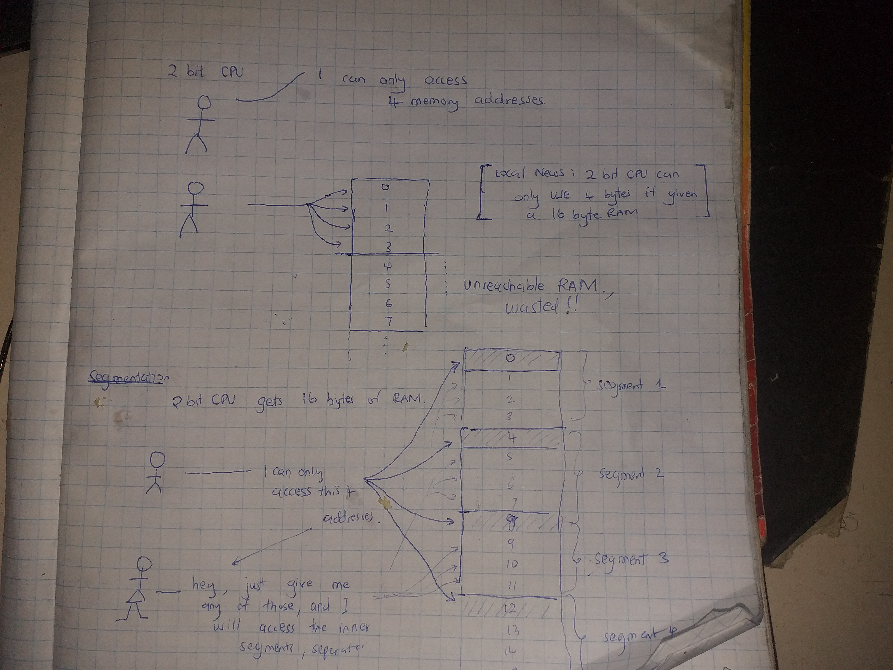
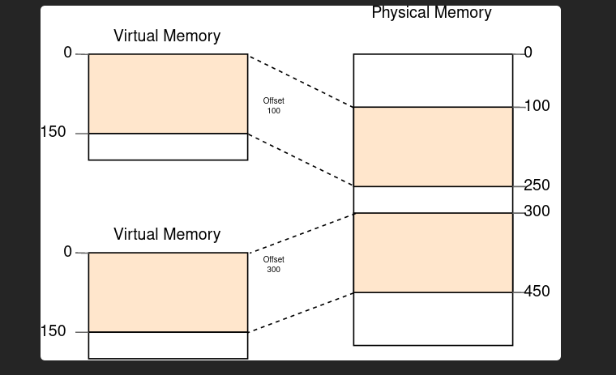
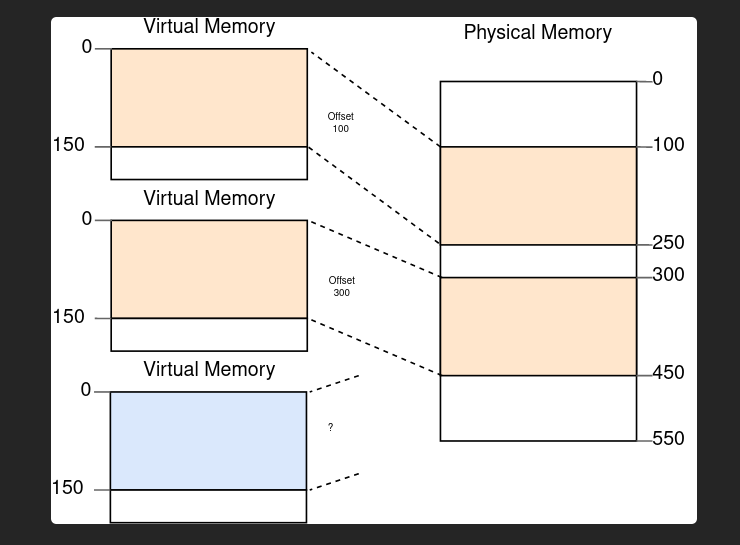
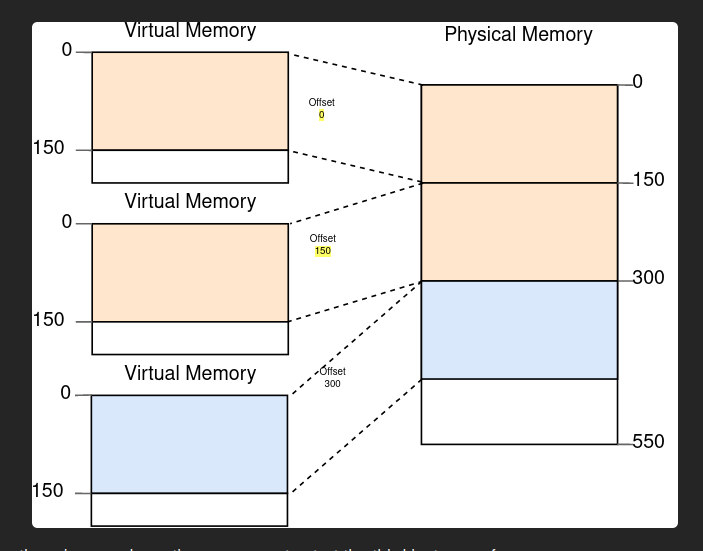

# segmentation

If the CPU has 16-bit registers, it means that by default, it can only access 2^16 physical memory addresses.  That means that ideally, if each physical address in your computer represents one byte then you can only use 16 KiB of RAM.  
If the CPU has 32-bit registers, it means that by default, it can only access 2^32 physical memory addresses.  That means that ideally, if each physical address in your computer represents one byte then you can only use 4 GiB of the RAM.  
If the CPU has 64-bit registers, it means that by default, it can only reference 2^64 physical memory addresses. That means that ideally, if each physical address in your computer represents one byte then you can only use 16777216 TB of RAM.   

Now the problem is that the amount of RAM usable by the CPU is determined by the register size of the CPU. This is not good.    
So people came up with something called segmentation.   

Under segmentation...   
1. You insert RAM of any size to your computer, do not give a hoot about the register size of your CPU.
2. Segment the whole RAM into segments, The number of segments should be equal to the number of addresses that your CPU can ideally access. For example if I am using a 16-bit CPU, I would divide the RAM into 2^16 segments.
3. Hardwire the CPU to only access the start address of each segment by default. Now the inner addresses contained in a segment have become inaccessible by the CPU.
4. Come up with new registers that store the offset if an address in relation to a segment start.   
5. Develop a special hardwired circuit that takes in the segement_start address AND the offset_value and directly reads from the inner sections of the segments
6. MAGIC!! now you can access all RAM's physical memory addresses.

Now the work of the CPU  was to pass the Offset and memory address to the segmentation circuit... and in turn it will get a value from memory.  
You can say that (memory + offset )== virtual address. Remember that a virtual addres is an address that can be translated to a physical address.   

### Segmentation becomes weak
Segmentation was doing fine for some time.  
BUT segmentation allowed you to use contiguous virtual addresses to reference contiguous physical memory addresses.  
You could not use contiguous virtual addresses to reference NON-contiguous physical memory addresses. This means that if you had to allocate memory, you had to find contiguous physical memory addresses... if there were only holes in memory, you HAD TO DEFRAGMENT the entire physical memory.  

Defragmentation is time_expensive and introduces performance non_determinism.   

Happy path : There is enough contiguous space  

Now there is no enough contiguous space :

You are forced to de-fragment the physical memory so everything fits:

