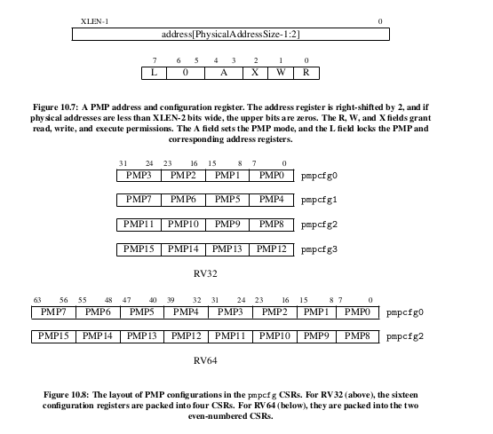

# seperating_user_mode_from_machine_mode

Being in machine mode gives you power to access all memory addresses.   
It also allows you to change the status of Machine Mode CSRegisters. This have serious actions, for example, using the mstatus register, you can disable the CPU from reacting to any interrupts.   

So the Machine Mode should only be allowed to run trusted code.  
People came up with User Mode.  

In User mode...
1. You can only access the memory that the Machine Mode has allowed you to.
2. You cannot access Machine Mode Registers
3. If you call any of the priviledged instructions, an "invalid instruction" exception is generated.

## Physical Memory Protection
As earlier said, the User Mode programs can only access memory that the Machine Mode has allowed it to.  
The CPU achieves this by using a mechanism called : PMP - Physical Memory Protection

Physical Memory Protection works this way : 
- You divide up our memory in sections
- You declare the access rights of each section. Ie, you declare whether the User Mode program can Read/Write/Execute that section.
- You store the start_addresses of those sections to special registers called "PMP Registers".
- You store those Access rights in a special register called "pmpconfig" register.

The A field of the pmpconfig register can be 1 or 0. 0 means that that configuration has been disabled.  
A PMP address is stored as a physical address that has been shifted to the left by 2 bits (It has a granularity of 4 bytes)

### **PMP in action**   
1. User-mode program tries to access memory address x.
2. CPU loops through the PMP addresses and checks whether memory x is greater or equal any of the PMP addresses.
3. If memory x is greater or equal to PMP address p BUT less than PMP address p+1, then we read the pmpconfig specifications of PMP address p+1
4. If the access rights conflict, an exception is thrown

### **Disadvantages of the PMP mechanism**
You can only create 16 sections. You can create 16 pages. With a virtual paging system memory system you can get more granularity. This does not cater for a system that runs multiple complex applications where each application may need its own pages, with different access levels.    

All Interrupts and Exceptions are handled in Machine mode by default. But you can make the Supervisor Mode handle some exceptions and interrupts by using the medeleg and mideleg registers