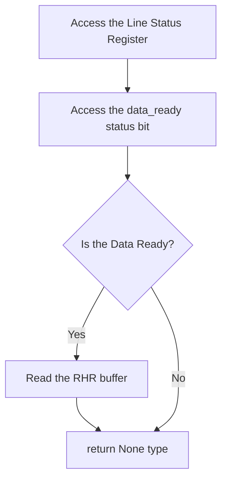
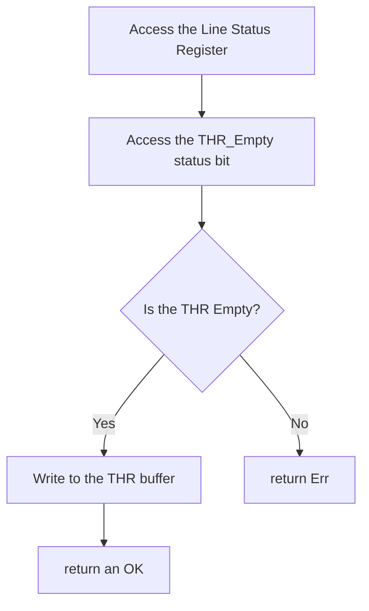

# Setting Up Communications

References :   
    - [Chapter 3 : How to write Drivers for Peripherals](https://docs.rust-embedded.org/book/peripherals/index.html)    
    - [Communications : the UART Driver](https://osblog.stephenmarz.com/ch2.html)      
    - [The UART specifications](https://www.lammertbies.nl/comm/info/serial-uart)      
    - [The UART Datasheet](http://caro.su/msx/ocm_de1/16550.pdf)     

Our OS will communicate with peripherals. Peripherals are external devices...external cirtuits... things that are not originally part of the Motherboard.   
In this chapter, the peripherals that we will be attaching will be the console output and the keyboard for input.     
The connection between the microcontroller and both of these peripherals is a serial connection.   

### Why a serial connection?  
Inside the motherboard and the peripherals, there are parallel connections connecting the  internal components.   
Parallel connections are wide. manufacturing wide cables is expensive. So people resorted to just manufacturing single line cables.  
And then they created algorithms to convert parallel bits to a stream of contiguous bits ... and vice versa.   

### The UART Driver
The UART device is a hardware device that stands in between a parallel connection and a serial connection. It converts a serial signal to a parallel signal and vice-versa.  
It stands between the motherboard and the peripheral devices that use serial connections ; eg mouse, keyboard and console output.   

#### Why are we not using the USB driver?  
The USB also does the conversion of parallel signals to serial signals. The USB has higher transfer speeds than the UART connection. The USB can do 20 Gbps while the UART does around 1 Mbps.  
However, we used the UART because of its simplicity in configuration : this is a learning project, we cannot afford the complex nature of trying to configure the USB.  

In the case of Qemu, the console output and the keyboard use the same UART device. This is because the transmit_out channel is connected to the console output AND the receive channel is connected to the keyboard.

#### Theory of parallel to serial conversion
Before we discuss the actual registers, let's discuss the theory of parallel-to-serial conversion.  
1. On the Sender's side
The serializer gets configured by the host system. The baud rate is set, the size of a data frame is set and interrupt handling is configured.
The serializer hardware receives parallel input... let's say 8 bits.  
The serializer sequentially pushes each bit of that parallel input into a shift register. Whether it begins from the Most Significant bit or the LSB is up to the specifications of the communication protocol being used.    
The serializer packages the shift register bits as a data frame, with a startbit, a stop-bit and maybe a parity bit for error checking.   
The serializer sequentially pushes the bits out of the shift register and into the transmission channel.  
The way it pushes the bits into the line can be either FIFO or FILO.  
The rate at which it pushes the bits into the transmission line is called the Baud Rate. It is measured in bits per second. In this case, baud rate is the same as bit rate because each bit change equals a bit transmission.  

2 On the receiver's end
It is assumed that the receiver has the same configurations as the sender: same baud rate, same data_frame size.  
The deserializer receives the serial data frame.   
checks the parity bit for error detection  

#### The UART Registers

The UART emulated in Qemu is the NS16550A UART chipset. We control the UART using MMIO programming. The Base address of the UARTs begins at 0x1000_0000 and each UART device is given an offset of 0x100 (256 bytes)  

The UART has 8 physical registers that can be interpreted as 12 logical registers... this is because some of the physical registers can be used differently under different contexts. For example Register 000 can be used as an input register when the UART is idle, but when the UART is not idle, the same register will be treated as an output register.    

Below is a diagramatic representation of the UART registers :    
  
Notice that there are registers that share the same physical space. For exapmple.... see below   

From the image, there are only 8 bytes of spaces used to represent all the 12 registers. This is becuse there are registers that share byte space : 
1. The Receive Buffer Register(RBR), The Transmitter Holding Register(THR) and the  Divisor Latch Least Significant Byte (DLL) can occupy the same byte space.
2. The interrupt Status Register and the FIFO control Register occupy the same byte space.
3. The Line Status Register and the Prescaler Division  can occupy the same byte space.
4. The Interrupt Enable Register and the Divisor Latch Most significant Byte share the same byte space.

All registers are 8 bits long. We will not discuss the DLL, DLM and PSD registers.  
##### 1. The Line Control Register
The line control Register is used to configure the UART communications.  
Using this register, you can set the format of the data frames being transported.  
Using this register, you can set the size of the data frame.  
Using this register, you can determine whether we will be able to set a custom baud rate or use the default baud rate.  
   - Bits [1:0] are used to set the word_length ie. the length of the Data frame. The legal values are :
  
   - Bit [2] is used to set the number of stop bits to be included in the transmission frame : 0==one stop_bit and  1 == two stop bits
  
   - Bits [5-3] are used to set the parity type of the data frame to be transmitted
   - Bit[7] is the DLAB bit. Setting this to 1 means that we get to acces the DLL, DLM and PSD registers to set the baud rate

##### 2. The Line Status Register
This register contains the info about the communicatiuon line. If any error occur, they are also reflected in this register: 

undone (dexcribe the rest of the registers)

Regit

#### Initializing the Communication between the 2 devices.  
Initializing the communications between the 2 devices means that we configure the UART protocol.    
We need to define :
1. The maximum amount of bits that can be contained in the buffer at a time. The 2 devices need to agree on this so that data does not get lost if one of the devices buffer is too small.
2. Set the order of reading and writing to the communication buffer. In our case, we set the order to FIFO (First in First Out).    
3. Define how the CPU and the UART will communicate with each other when the buffer is ready to be read or written to. You can choose between 2 methods ; Poll driven communication od Interrupt driven communication.  
In Interrupt driven communication, the UART device sends interrupt signals to the CPU whenever the read buffer is full. And consequently, the CPU invokes the appropriate interrupt handler. You have the option to involve the PLIC or not.    
In the Poll driven communication, the CPU will occasionally check if the buffer is ready to be read or written to.   
4. Set the data transfer speed between the 2 devices - the baud rate. This is to avoid data loss.

But here is a relief : If we set the DLAB (Divisor Latch access bit) to zero, then :
- The Prescaler Division Register becomes inaccessible. Meaning that the Line status register does not have to share the byte space.
- The DLL register becomes inaccessible, meaning the RHR and THR don't have to share the byte space.
- The DLM register becomes inaccessible, meaning that the Interrupt Enable Register does not have to share the byte space.

That is the path we will take, we will set the DLAB bit to zero so that we access the registers in a more simple manner. The reason that makes it okay to disregard setting the DLL, DLM and PDS registers is because we do not need them. These three registers are used to set the Baud Rate of the UART device.

We are in Qemu, this is a virtual space. This means that we are not dealing with real physical devices. Because of this fact, it is not necessary to set the Baud Rate. The machine emulates the maximum baud rate available.

The Baud Rate formula is as follows :  
Divisor = UART_device_clock_frequency / ( Baud_rate x Prescaler_Division_value)     

where :
- Divisor is a 16 bit value whose first 8 bits get stored in the DLM register and last 8 bits get stored in the DLL register. If we do not set the DLL and DLM bit, the Divisor value is assumed to be  65,536 (2^16).
- UART_device_clock_frequency is the clock speed of the particular UART implementation. eg 16MHz
- The Baud_rate is the rate at which data transfers, this is what we are trying to calulate.
- The Prescaler_Division_value is found in the Prescaler_Division register. It is represented using 4 bits, its value ranges from 1 to 16. If we do not set the prescaler division value, 16 is assumed to be the default. We are okay with 16

We will use this registers to :     
1. Initialize the communication between the 2 devices
2. fetch and write data to the communication buffers

##### Pseudocode for initializing the UART communication
input : the UART base address (hopefully from a struct abstract)
output : No_output

1. set the word length to 8 bits
   - access the lCR register
   - set bits [1:0] to [1:1]
2. Enable FIFO reads and writes
   - access the FIcaler Division RegisFO control Register
   - turn the FIFO enable bit to 1
3. Set the interrupt capability 
   - Access the Interupt enable Register
   - enable the data ready interrupt [set bit 0 to the value 1]
   - enable the transmitter empty interrupt [set bit 1 to the value 1]
4. Set the Baud rate
   - since we are setting the BAUD rate at 2400, the divisor value is 592
   - use bitmasking to separate the most sigificant bytes from the least significant bytes
   - Set the DLAB bit to 1 in order to allow setting the Baud rate
   - store the two seperate values in the DLL and DLM respectively

#### Reading from the UART
When the buffer is full, the UART sends an interrupt to the PLIC. The PLIC calls the interrupt handler. The Interrupt handler invokes a UART read (This function that we are writing now). The read input can be directly displayed in the console output or stored in a buffer

##### Pseudocode
input : the UART base address (hopefully from a struct abstract)
output : Option<None, BYTE>

1. Access the Line Status Register
2. Access the data_ready status bit.
3. If the data Bit is 1, continue to step 5
4. If the data bit is 0, return None
5. Read the RHR buffer and return the read byte.

When the interrupt handler calles read function, it stores the inputs in a curcular buffer. From this buffer you can choose hich inputs to display to the console or process

##### Control flow diagram of the UART read

#### Writing the UART
When the buffer is empty, the UART sends an interrupt to the PLIC. The PLIC calls the interrupt handler. The Interrupt handler checks if the UART_console_write_buffer is empty. If the Buffer is empty, the Interrupt handler does not call the UART_write function.
If the UART_console_write_buffer is not empty, the interrupt handler calls the console_output_feeder.

##### Pseudocode
input : the UART base address (hopefully from a struct abstract), the byte to be written
output : Result<Ok, Err>

1. Access the Line Status Register
2. Confirm that the THR is empty
3. If the data Bit is 1, continue to step 5
4. If the data bit is 0, return Err
5. Write to the THR buffer and return an OK().

When the interrupt handler calles read function, it stores the inputs in a curcular buffer. From this buffer you can choose hich inputs to display to the console or process

##### Control flow diagram of the UART read

#### UART Buffer management
Data coming from the keyboard can either be displayed to the console or stored for further processing. For this reason we will have a ring buffer for storing read input. Whatever you choose to do with this data is up to you

With this input buffer, we can implement scanf. 
We can also confortably implement a function that continuously reacts keyboard input. (eg, continuous console display)

Data coming from the programs might also need to be displayed . That is why we have the UART_console_write_buffer. Strings from the user or kernel programs get stored in this queue. From there, when we receive a THR_empty interrupt, 

#### Driver exposed API
- Clear input buffer (everyone)
- Read input buffer (everyone)
- Read line  (Everyone)
- Read word  (Everyone)
- Write word (Everyone)
- Write line (Everyone)
- Determine interrupt type (User PLIC)

#### Interaction with the PLIC
The PLIC receives interrupts from the UART whenever the Data Buffer is full_and_ready_to_be_read. When the PLIC receives this interrupt, it does not really know what the interrupt is all about. So it needs to read in the UART Line Status Register and determine which event caused the interrupt. This situation is valid only when the UART is set to send interrupts because of many reasons.

However in our case, the PLIC sends interrupts only when Data Buffer is full_and_ready_to_be_read, so we do not need a function to determine the type of interrupt. the type of interrupt is always "data Ready"

### Principles when abstracting hardware 
1. The struct used to abstract the hardware MMIO map should be compiled in a predictable manner (C ABI)
2. We should always use volatile reads and writes to the MMIO registers
3. In software, we should be able to share any number of read-only accesses to these peripherals
4. If some software should have read-write access to a peripheral, it should hold the only reference to that peripheral

#### Why use the C ABI?
The C ABI is used for the sake of compatibility and predictability. For example, the Rust struct fields can get re-ordered while the C structs field order is static. For example, if a struct field has 2 integer fields and 1 boolean, normally the field order would be as declared. But if the boolean is accessed more frequently, it might be re-odered and placed at the beginning to improve cache locality.  
In this case, we need the struct order as static.  

#### Why use volatile reads and writes?
When you write to the same memory address for a couple of times, the compiler might optimize the code and just consider the last write value. Meaning you will lose a couple of writes due to compiler optimization.

When you read from the same memory a couple of times, the compiler might optimize the reads using a cache;
Volatile read the image, there are onl

#### Why we won't use global mutable variables to abstract our UART driver 
In Rust, global mutable variables are considered unsafe. You have to enclose any interactions with them using the unsafe block.  
They are unsafe because :
1. They can lead to data races when multiple threads have r/w access to it. --> 
2. They can lead to memory unsafety. 
   - If the global variable is uninitialized and a read operation is executed, it may cause a null dereferencing problem. There is a chance of this happening because the thread that was taking care of initialization did not execute before the thread that read the global variable.
   - If the global variable is not initialized in a timely manner, a write to the location may cause a bufferoverflow.
3. It is hard to organize code that is full of global mutable variables. It is hard to debug such a program.

So ... moral lesson : Try your best to never use global mutable variables.

We can implement the 3rd and 4th [Principles](#principles-when-abstracting-hardware) using the Singleton structure. Our singleton strategy is not thread safe (undone)

# I2C
   - packet-wise, has start and stop bits. Not streaming
   - 
# SPI
   - continuous, not packet-wise. data does not have  start and stop bits
   - data can be transferred without interruption. Any number of bits can be sent or received in a continuous stream.... NOT packetwise
   - 
# UART
   - packet-wise, has start and stop bits. Not streaming
   - 