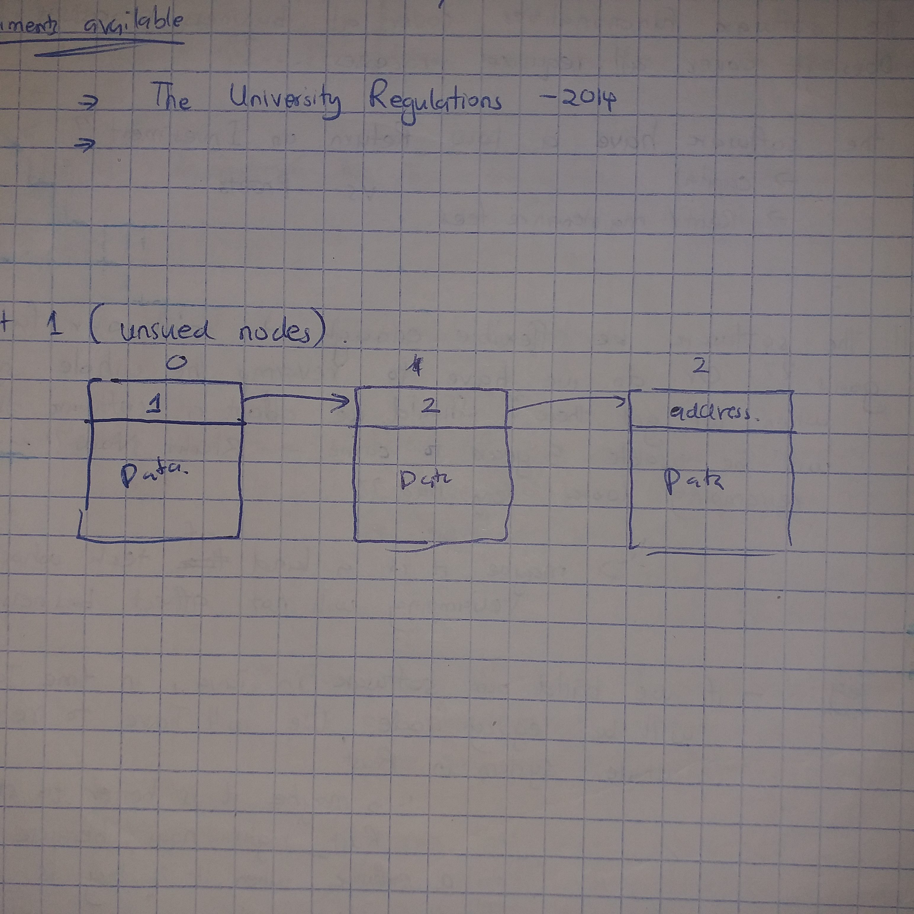
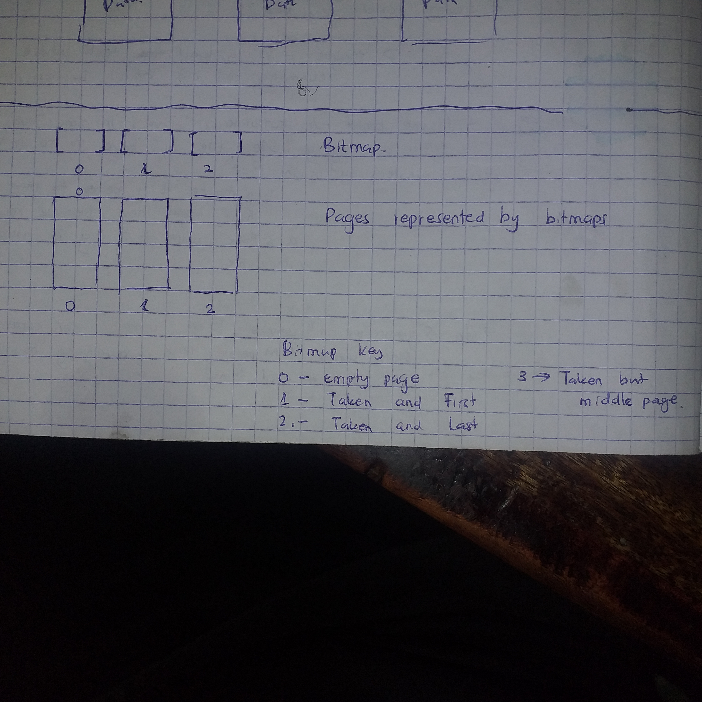
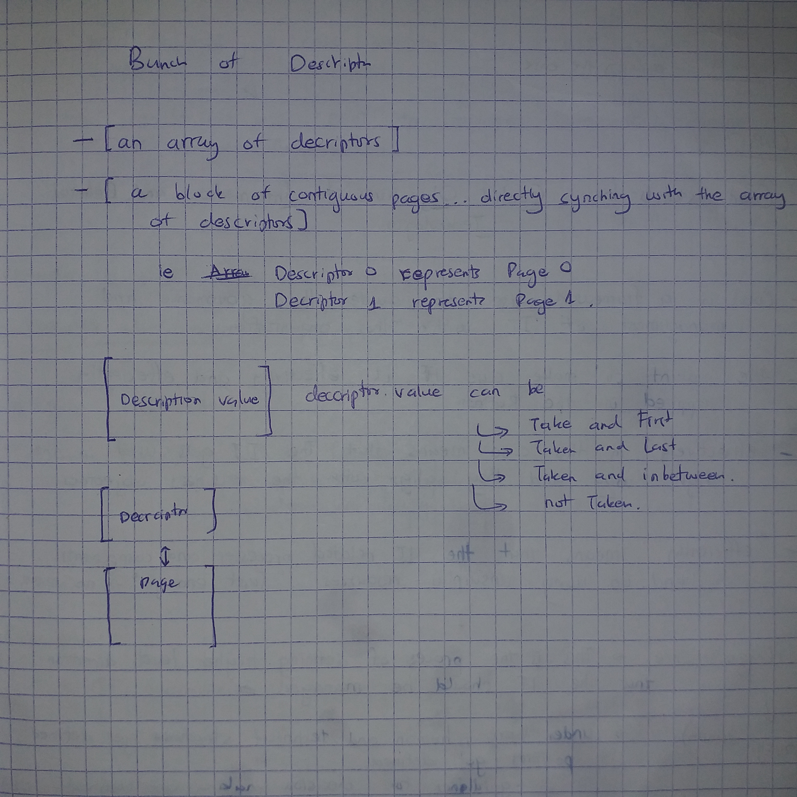

RAM memory management

- Our elf file gets loaded into the RAM (128 Mbs) by the elf_file loading system found in Qemu.
- Or program starts off at 0x8000_0000

- The RAM takes the following format in our case : 
  - ORIGIN = 0x80000000, LENGTH = 128MBs
  - text section : _text_start --> _text_end
  - Global Pointer
    - rodata section : _rodata_start --> _rodata_end    :   length is variable...just continuous : position 
    - data section   : _data_start --> _data_end        :   length is variable...just continuous 
    - bss section    : _bss_start --> _bss_end          :   length is variable...just continuous
  - Kernel Stack
    - length : 524 KiB
    - start  : _bss_end
    - end    : _bss_end + 524 KiB in hexadecimal
  - Heap
    - length : Total memory - Memory occupied by all the above sections.
    - start  : Kernel end
    - end    : End of memory ie (ORIGIN + LENGTH)

#### UNDER THE HEAP
we have the following segments:
1. An array of descriptors
2. A countiguous allocation of pages

- When creating the memory management system of the OS, we have to take care of 3 responsibilities:
  1. Find a way to allocate and deallocate physical heap memory byte_wise.
  2. Find a way to allocate and deallocate physical heap memory page_wise.
  3. Find a way to create a safe interface between programs and the memory itself  
     - This interface will :
       1. Abstract the physical memory by providing virtual pages and virtual bytes
       2. Make sure the access rights of each page is defined in a procee_wise fashion.
       3. Provide a special API to the Kernel. Provide a different API to the normal processes.

- Why is the Kernel getting a special API? What is contained in the API? 
- We could have used the hardware assisted memory management scheme in Riscv... but why are we not?  Write you tradeoffs here future James
  - The SV39 system is hard to understand for me

- Why have we not used the sv48 or the bare metal system? When would they have been appropriate? What tradeoffs did we consider?

### Page Grained Physical memory allocations
- It means that when free memory is either allocated or deallocated... it is done in a pagewise manner. ie The address of a new empty page is returned when an allocation is needed.
- A page in our system is 4096 bytes long. ie 4 KiB
- A page allocation is less precise than a byte allocation. Allocating a whole page(4096 bytes) in a single command is better than allocoting bytes 4096 times. It means you need to execute 4096 byte-wise commands in order to do what a single page command would have done.
- Also building a management system for bytes is harder than building the same sytem for pages. There are more items to manage in a byte-wise system... for one page that you need to manage... you need to manage 4085 more items if you had taken the byte route.

- However, developers writing memory efficient systems may need a byte grained system ready for action in serious cases.

So in our page allocation system we need to achieve the following :
1. Keep track of all free pages
2. Keep track of all allocated pages
3. Keep track of pages that have been used together
4. Provide a function that receives a request of allocating certain number of contiguous pages... and it returns the address of the first page of the available contiguous pages
5. Provide a function that receives an address of occupied pages and completely frees them.

We could implement our tracking system using one of the following methods :
1. Treating each page as a linked list node.

At the top of the Node, we have a pointer to the next node. So we create 2 lists... used nodes and unused nodes
   - This method helps because there is no need for contiguous allocation of pages. This consequently means that we will not have [fragmentation issues](./fragmentation_issues.md)
   - However this method has a couple of disadvantages :
     - It takes more space. This is because you have to store the address of the next node + information as to whether it is the last block or not.
     - The fact that memory allocated is not contiguous means referencing memory gets compicated. You cannot simply use straight foward offsets. You have to use virtual offsets that adds upon performance inefficiency.
     - The pages are dirty. The top part of the page has the address of the next node. If a process want to read or write to the page, it has to consider that some information contained in the page is useless to it. And when a couple of pages are read, the process has to filter out the next_address and start concatenating necessary data. This is unnecessary work
     - There is no direct access within the linked list... you have to traverse it from the beginning each time. Thi is a very huge DEFFIFIENCY because we are dealing with the RAM. Ram daa access is expected to be fast. If we has used an array or some tree structure, the CPU would have had faster access speeds.
1. We could use a 2-bit bitmap : THis is the fastest and most memory efficient method

2. We could use a bunch of descriptors. This would be the same as that of a bitmap execution. It is just that each descriptor takes 1 byte to describe a page while in the bitmap uses only 2 bits to describe a page (empty, taken, first, last)

More discissions about memory tracking are found [here](./memory_tracking_mechanisms.md)

We opt to use descriptors because :
 - Even though Bitmapping is more memory efficient than using descriptors...Using descriptors is simpler to implement. Using Bitmapping would cut our memory usage by 75%. But for now...this is a learning project.... simplicity is our first priority. 
 - Using a Linked List has only one advantage ; it solves the fragmentation issue. Other than that it is memory inefficient, performance inefficient and hard to implement. If we implement inodes on top of descriptors... fragmentation problems in the descriptor method becomes solved.

#### So what is this descriptor method of tracking?
A descriptor is an 8byte enum that Describes the status of a page. The value of the enum can be one of the following values :
    - page is empty
    - page has been taken and it's the first node for a certain contiguous allocation
    - page has been taken and it's neither the first nor the last node for a certain contiguous allocation
    - page has been taken and it's the last node for a certain contiguous allocation

1. We divide the heap into pages that are aligned to 4KiB.
2. We segment the heap into : 
   - Pages used to store descriptors  - segment 1
   - Pages used to store data         - segment 2
3. Under the segment 1, we store an array of descriptors. The number of descriptors is equal to the number of pages that can fit in the segment 2 of the heap.

#### The allocation method
algorithm : alloc
inputs to alloc algorithm : the number of free pages required (required_pages)
Outputs to alloc algorithm : the address of the first page of a contiguous block of free pages (starter)
main goal : return an address to the first page of a free contiguous set of pages  : A RESULT VALUE (pointer/ error)

Steps:
1. Confirm that the number of required pages is more than zero.
   1. If number is zero or less
      1. throw an [Error M1](./errors.md)
      2. return the error to the calling function.
   2. If the number is more than zero... continue to step 2
2. Traverse the array of descriptors found in the heap
3. Try to Find a block of contiguous free pages
   1. If you find a block... skip to step 4
   2. If you traverse the whole array and you do not find space ... skip to step 5
4. Do the folowing :
   - update the descriptors that represent the block
   - return the pointer to the first page of the block
5. Do the following
   - return an [error_M2](./errors.md) indicating that there is no free contiguous space.

#### The de-allocation method
algorithm : dealloc
inputs to dealloc algorithm : the address of the first page of a contiguous block of pages that needs to be freed (starter)
Outputs to dealloc algorithm : The Result Type (Ok/Error)
main goal : deallocate 

Steps:
1. Check if the starter address is valid or not.
   - If the starter address is a null pointer... go to step 2
   - If the starter address is an out of range address... go to step 3
   - If the starter address is a valid address...go to step 4
2. Return a Result_Error showing that the process tried to deallocate a null pointer : Error_M3
3. Return a Result_Error showing that the process tried to deallocate a non-existent memory location : Error_M4
4. Loop through the allocated block page by page :
   - For every page...
     - clear the data by zero-ing the bytes within the page
     - Change the status of the corresponding descriptor to 'empty'
5. After the loop, return a successful message Result (ok) type

#### API 
- dealloc function for user heap
- alloc function for user heap
- dealloc function for kernel heap
- alloc function for kernel heap

#### Testing this module
This module does 3 tasks. So we need to test all the 3 tasks.
1. Task 1 was : abstracting the heap into descriptors and pages.
2. Task 2 was : writing a function that returns the address of the first page associated with a free block of contiguous pages
3. Task 3 was : writing a function that frees a contiguous block of contiguous pages

##### Test 1 : Testing task 1 :
In this test, we compare preconfigured data that we calculated in theory and hope that our alocation function produces similar data.  
Confirm if the following values are similar:
- The heap_start address
- The heap_end address
- The number of data pages
- The number of descriptors
- number of descriotors == number of data pages

- Confirm that all the addresses of each page are a divisible of 4096
- Confirm that all descriptors are initially set to 'empty'

##### Test 2 : Testing Task 2, the allocating function
- confirm that submitting a zero to the function returns the appropriate Error 
- Confirm that submitting a value more than the number of pages found in a <128 MB heap will give the appropriate error.
- confirm that certain descriptor change after allocation : we should have a "first" and "end" and possibly a middle. But not 2 consecutive "firsts" or "ends".

##### Test 3 : Testing Task 3, the deallocation function
- confirm that submitting a null pointer yields the appropriate error
- confirm that submitting a pointer that is not within the heap range yields the appropriate error
- Confirm that all the data pages are indeed zeroed after deallocation and that they contain no garbage data or residue data.
- Confirm that all descritors involved in the deallocation process are updated to 'empty'

### Designs 

