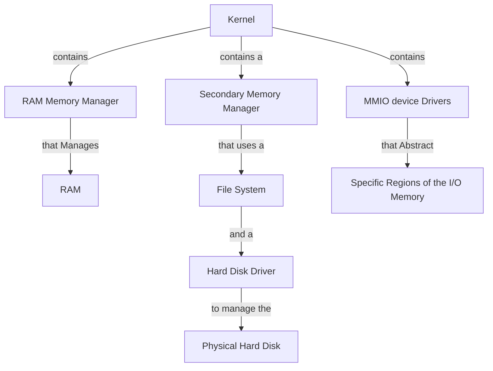

# Setting Up Memory Management

Our OS is dealing with different kinds of memory. We have : 
1. The RAM
2. The I/O memory
3. The Secondary Memory (The HDD, Hard Disk)

We have to manage each of these memory types. In this case management means :
1. Safely Abstracting the physical memory bytes using software.
2. Define methods of correctly allocating memory.
3. Define methods of correctly deallocating memory.
4. Defining methods of accessing the correct memory sections.

Each memory type has different implementations of the above three functions.    
For example, we need to define a file system as a way of managing the Secondary memory. 
As for the RAM, we need to define a Virtual Paging System that has access control capabilities.

We will not manage I/O memory that much, we will use structs to abstract the different MMIO regions. This feature is not essential. [undone]