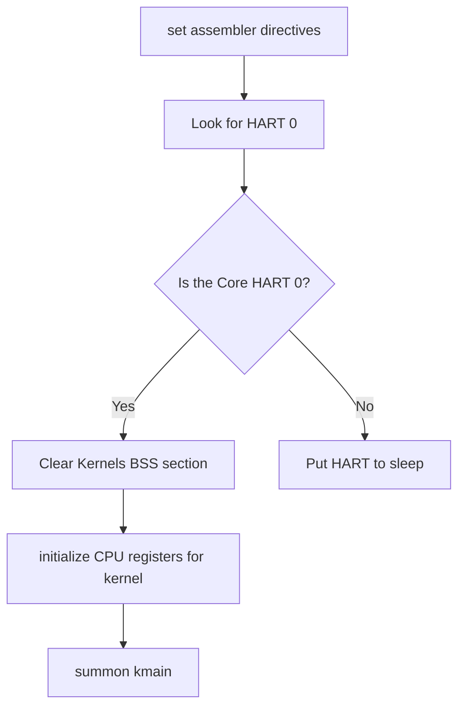

# The Bootloader  

For a long time I thought the way the CPU worked was some dark magic.  

The CPU is an indiscriminate machine, it is just a bunch of circuits that repeatedly do one thing from the moment it is powered on : 
- It reads the program counter register
- Fetches the instruction pointed to by program counter from some memory
- Executes the instruction using its circuits
- repeats infinitely

It is up to us to occasionally make the program counter to point to the instrutions we want executed.  
To control this machine, we have to change the value in its control status registers.  
When you look at it from this perspective, it no longer seems like dark magic.  

We will be using RISCV assembly to write the assembly code for the bootloader.  
The Basic Bootloader is a software program that :
    - Finds the kernel image
    - Loads the kernel image to memory
    - Transfers control to the kernel


The Bootloader has many definitions depending on the additional functionalities it has :
    - Dealing with the convertion of CPI from real mode to protected mode and finally to 64-bit mode
    - Having a user interface that gives its users the option to choose among multiple kernel images
    - Having the bootloader code implemented in seperate parts.  
    - Having the bootloader do some tasks that were originally meant for the firmware eg. Power_on_self tests


### The Boot process
References : 
- [Booting in x86 CPU](https://os.phil-opp.com/minimal-rust-kernel/#the-boot-process)
- [Booting In RISCV](https://osblog.stephenmarz.com/ch1.html)

When the machine is powered on : 

#### The Firmware
The CPU begins its fetch-execute cycle. Typically, the PC register of the CPU points to a memory address in the ROM.  
The ROM contains hardcoded firmware code. In x86 this firmware can be BIOS or UEFI. 
The firmware code performs Power-on-tests on all pluged devices.   
The firmware code initializes the hardware : for example it maps the dedicated I/O MMIO memory and enumerates the RAM.  
After setting up the execution environment, it scans the plugged in secondary memory devices... Depending on the partitioning scheme used in those devices, it looks for valid bootloaders. At this point some firmware give the user a chance to choose which bootloader they would prefer among the ones the firmware has discovered

#### The Bootloader
After the Firmware has set up the execution environment, It makes the CPU pointer ton point at the entr point of the boot_code.  
In our case, the bootloader will do the following functions :
1.  Pick only one CPU to complete the execution of the bootloader code. This is because at the beginning we do not want any kind of paralellism. Moreover, the bootcode is a simple code that can easily be done by one CPU, adding parallelism increases unnecessary complexity. It means we will have to do interprocessor communications at the start. That is just unnecessary overengineering to save a nano_secog of a nanosecond of a nanosecond
2. Clear the uninitialized memory sections : the heap and BSS section.
3. Transfer control to the Kernel code found in memory

##### pseudo code
inputs : No inputs
outputs : No outputs

- set the necessary assembler directives
  - notify the assembler that the code should not use compressed code
- define the memory sections
  - .text.init section : the .text.init section is different from the .text section because the .text.init section contains initialization code that gets executed before the main function.
  - .data section
- Choose HART 0 as the main and only core
  - if the Hart ID is not 0, subject that core to an endless sleep
- Confirm that the HART is in machine mode
- fetch the global pointer so that we ge to access the data sections more confidently
- Clear the BSS section, we need no surprises.
- Setup the CPU status to suit the jump to kernel code :
  - set the medeleg register  : we will not delegate any exception, we will handle all exceptions in Machine mode
  - set the mideleg register  : we will not delegate any interrupt to lower levels, we will handle all interrupts in Machine mode
  - set the mstatus to allow software interrupts and external interrupts
  - Set the MIE register to handle only 
  - set the stack pointer to point at the bottom of the stack
  - set the mstatus register :
    - allow interrups to be allowed in both machine mode and supervisor mode by setting the MPP(Machine Previous Protection) to the value 3 
  - set the MEPC ; machine exception program Counter to point to the kernel entry point.
  - Set the MTVEC : Machine Trao Vector to point to the Exception handling code
- Call MRET

**Why are we calling WFI?**  
We are calling the WFI instruction to put all the other CPU cores to sleep. Our OS only uses one HART (Cpu).  

The WFI (Wait for interrupt instruction) - This RISCV instruction powers off the CPU and only leaves a small circiut running. THis circuit continuously checks if an interrupt signal has been sent to the powered off CPU. If an interrupt is detected, the CPU gets powered on.  It is kind of a 'sleep' instruction. It can be used to save power when the CPU is idle.
We are calling the WFI instruction to put all the other CPU cores to sleep. Our OS only uses one HART (Cpu).


**Why are we disabling Riscv Compressed instruction?**
- So that we gain simplicity in debugging. 
  
In RISCV, the assembler usually encodes each assembly instruction into 32 bits. But this is not always the case, you can instruct the assembler to use compressed instructions. Compressed instructions are only 16 bits long. Not all assembly instructions get encoded to 16 bits... just a select few. This ensures memory efficient code.  
However, it makes it hard to debug code because the not ALL instructions are 32 bits as before.  

we achieve this by using either of the two assembly directives : 
```riscv
.option norvc      // No RiscV compressed instructions
.option rvc        // Yes to RiscV compressed instructions
```

**Why do we need to load the global pointer when writing the Bootloader?**
So that the bootloader code gets to use the correct global data associated to the Operating system image.  

The global pointer references the base address of global data in the memory map.  
To access any global data, you have to know the base address + offset.  
The bootloader typically gets executed as a seperate program from the operating system. So the bootloader may have a different memory map from the memory map of the kernel.  
Considering that the bootloader needs to use the operating system's global data, we make the global pointer that the bootloader references to be the gp found in the memory map of the kernel.  

Now this operation is delicate; we are accessing another memory map to access global data that may or may not be the same as the data we are trying to change. We need to make this operation explicit, no surprises. So we temporarily kill all code optimizations when doing this operation by using the directives :   

```riscv
.option push       // save previous assembly directives... because in the next few lines we may use contradicting directives
.option norelax    // no optimization
.option pop        // restore previous assembly directives
```

## Designs

#### Initial Program Flow diagram
<body>
  <pre class="mermaid">
        graph TD 
        A[Qemu ELF loader] -->|loads Elf file containing kernel loader| B[kernel Loader] 
        B --> |prepares the CPU registers for kernel, calls kernel entry point| C[Kernel Runs] 
  </pre>
</body>


#### Kernel loader sequence of events

