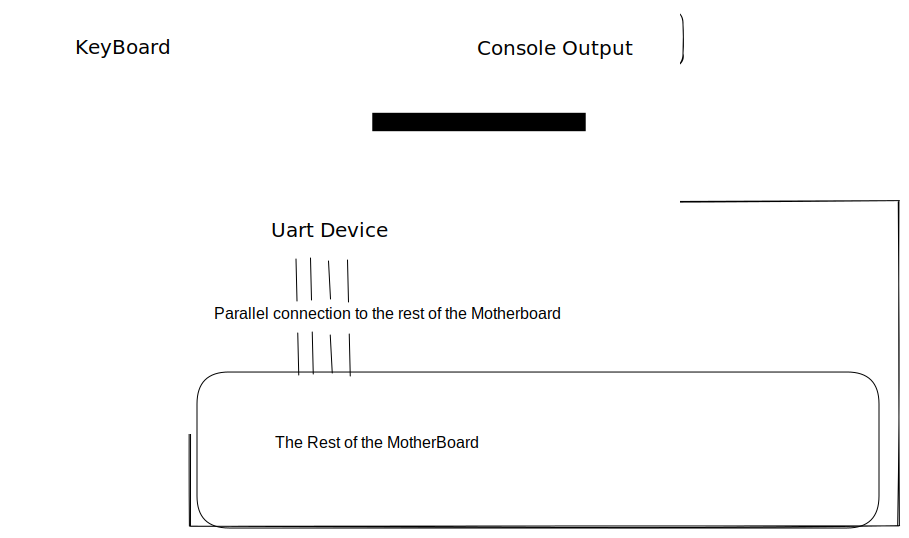
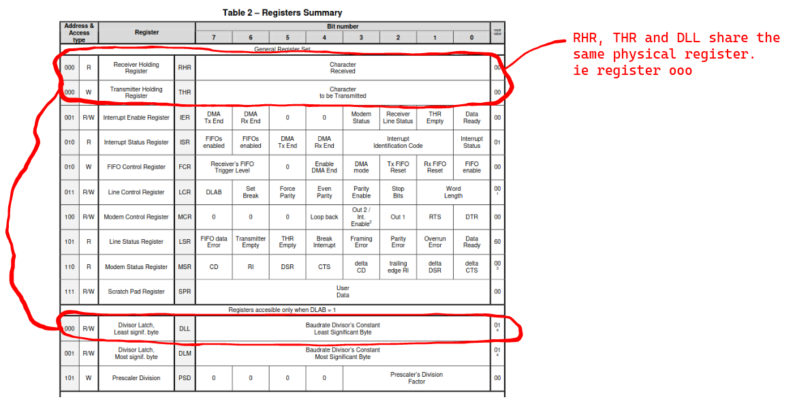
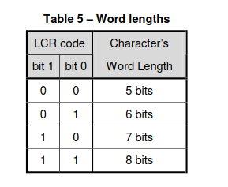
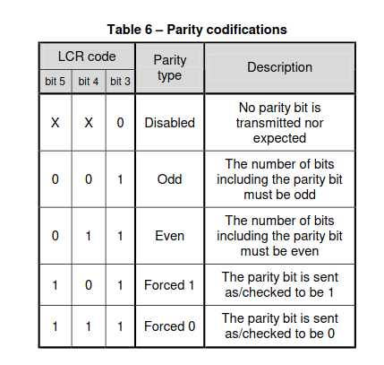
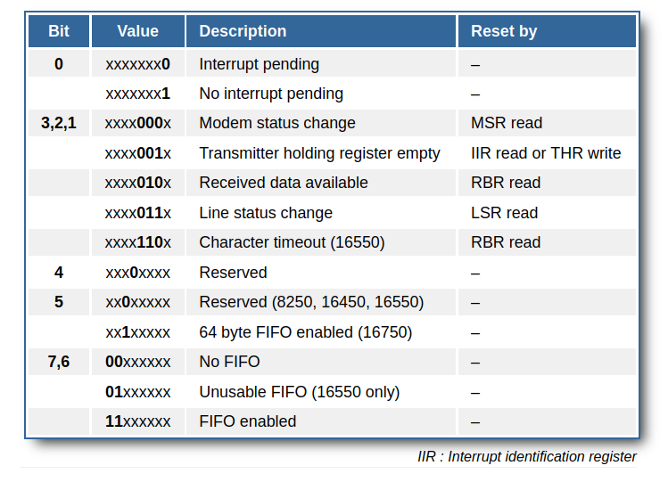

# The UART 

[references]
1. [UART communication protocol](https://www.circuitbasics.com/basics-uart-communication/) - just read this 
2. https://www.analog.com/en/analog-dialogue/articles/uart-a-hardware-communication-protocol.html

## Intro
The UART device is a hardware device that stands in between a parallel connection and a serial connection. It converts a serial signal to a parallel signal and vice-versa.  
It stands between the motherboard and the peripheral devices that use serial connections ; eg mouse, keyboard and console output.  
The UART driver is the software that controls and interacts with the physical UART device.    

In the case of Qemu, the console output and the keyboard input use the same UART device. This is because the transmit_out channel is connected to the console output AND the receive channel is connected to the keyboard.

## The UART Registers

The UART emulated in Qemu is the NS16550A UART chipset. We control the UART using MMIO programming. The Base address of the UARTs begins at 0x1000_0000 and each UART device is given an offset of 0x100 (256 bytes)  

The UART has 8 physical registers that can be interpreted as 12 logical registers... this is because some of the physical registers can be used differently under different contexts. For example The Buffer Register can be used as an input register when the UART is idle, but when the UART is not idle, the same register will be treated as an output register.    

Below is a diagramatic representation of the UART registers :    
  

Notice that there are registers that share the same physical space. For exapmple.... see below   

From the image, there are only 8 bytes of spaces used to represent all the 12 registers. This is becuse there are registers that share byte space : 
1. The Receive Buffer Register(RBR), The Transmitter Holding Register(THR) and the  Divisor Latch Least Significant Byte (DLL) can occupy the same byte space.
2. The interrupt Status Register and the FIFO control Register occupy the same byte space.
3. The Line Status Register and the Prescaler Division  can occupy the same byte space.
4. The Interrupt Enable Register and the Divisor Latch Most significant Byte share the same byte space.

All registers are 8 bits long. We will not discuss the DLL, DLM and PSD registers.  
### 1. The Line Control Register
The line control Register is used to configure the UART communications.  
Using this register, you can set the format of the data frames being transported.  
Using this register, you can set the size of the data frame.  
Using this register, you can determine whether we will be able to set a custom baud rate or use the default baud rate.  
   - Bits [1:0] are used to set the word_length ie. the length of the Data frame. The legal values are :
  
   - Bit [2] is used to set the number of stop bits to be included in the transmission frame : 0==one stop_bit and  1 == two stop bits
  
   - Bits [5-3] are used to set the parity type of the data frame to be transmitted
   - Bit[7] is the DLAB bit. Setting this to 1 means that we get to acces the DLL, DLM and PSD registers to set the baud rate

### 2. The Line Status Register
This register contains the info about the communicatiuon line. Also, if any error occurs, it is reflected in this register: 

### The Buffer register
This register stores data that either has to be transmitted across the communication line OR  it has been received from the communication line
When you read from this buffer, it is treated as The Receiver Holding Register  
When you write to this buffer, it is treated as The Transmitter Holding Register
   ### 3.1 The Receiver Holding Register
   This register is used as a data buffer ONLY IF the DLAB bit in the The Line Control Register is set to zero.  
   It acts as a data buffer for the data that has been received from a sender.  
   It is good practice to confirm that the data is read-worthy before reading it, you might read garbage. To confirm that data is read-worthy, check if the "Data Ready" bit in the status register is set to 1.  

   ### 3.2 The Transmitter Holding Register
   This register stores data that is to be transmitted across the line.  
   It is good practice to write to this Register ONLY when the buffer is empty. To check if the buffer is empty, check if the "THR Empty" bit in the Linestatus Register is set to 1.  

### The Interrupt Enable Register
[undone] Explain the Interrup Enable Register  

### The Interrupt Status Register
This register shows the following info :

[undone] (describe the rest of the registers when you get the time)  

* Added and Important

1. When Keyboard keys are pressed, they are stored in the UART FIFO_receive_buffer first.  
2. When the UART realizes that there is new data in the buffer, it does two things :
  1. It sends a data ready interrupt to the plic.  
  2. It changes the "data ready" bit in the Line status register from zero to one.
3. The plic informs the CPU that the UART has new data that needs to be read.
4. The CPU traps, it calls the trap handler to check things out
5. The trap handler does the following
   1. Summons the UART driver
   2. Uses the UART driver to read data from the UART buffer 
   3. Stores the read data in an stdin vector
   4. Informs the PLIC that the data has been sorted
6. PLIC acknowledges that the interrupt has been sorted
7. Interrupt handler returns control to the kernel. 
8. Once the Data has been read, the UART turns off the "Data Ready Bit" in the line status register. It also disables the Interrupt status

- The 
- The CPU reads the contents of the FIFO buffer byte by byte. If it reads a single byte, it stores it in the RHR buffer. 